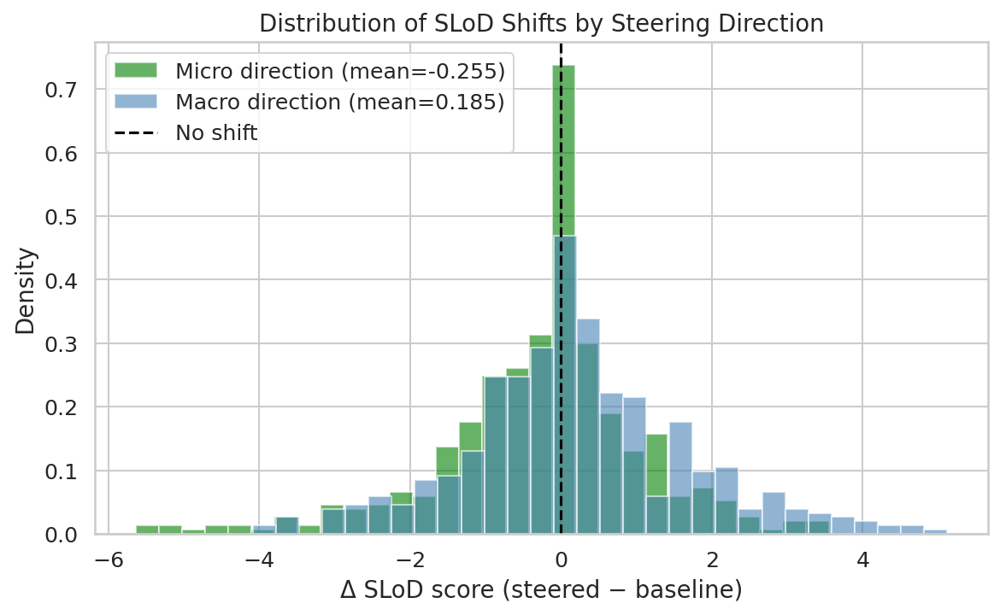
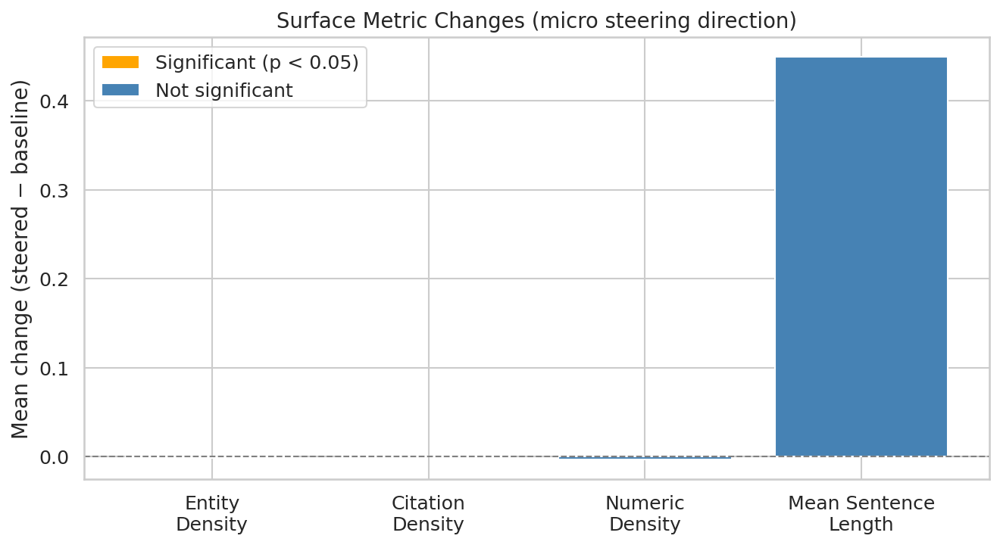
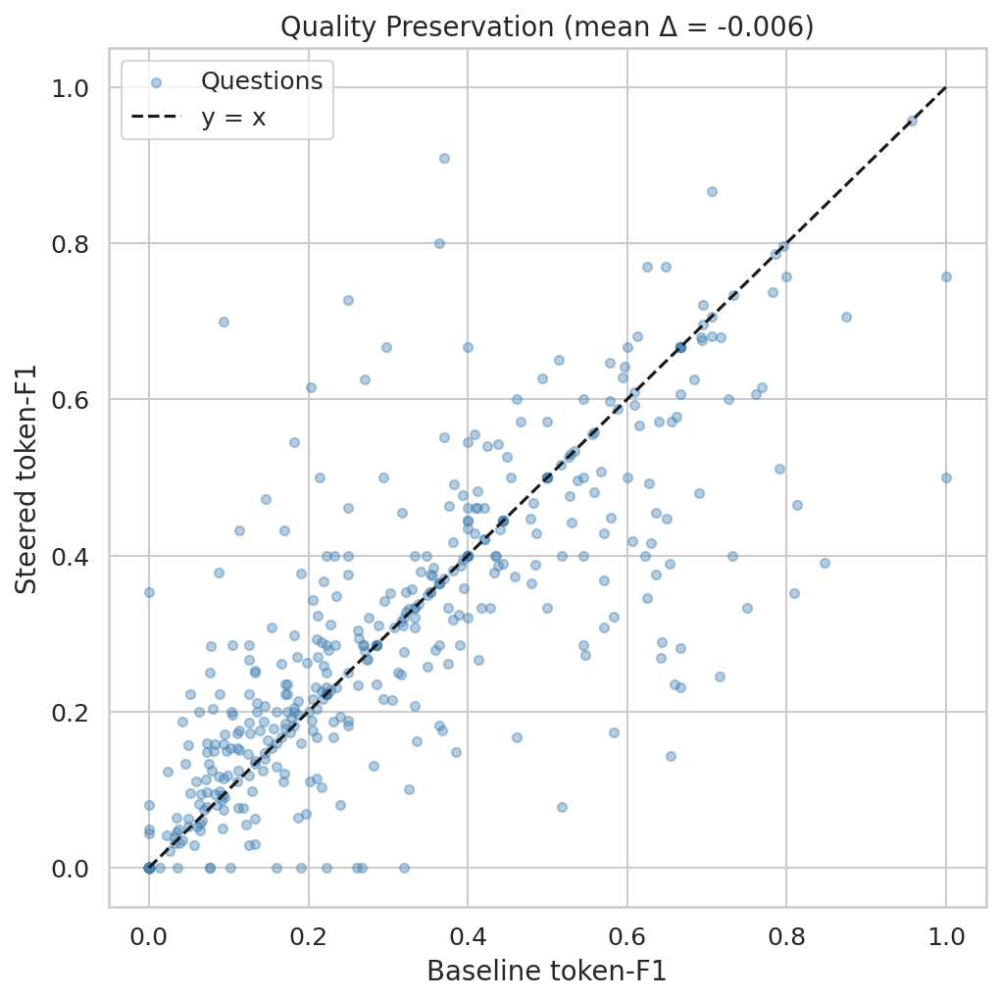
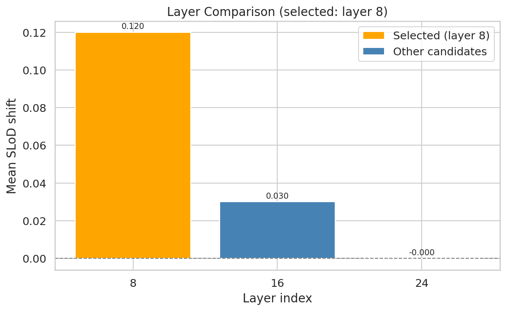
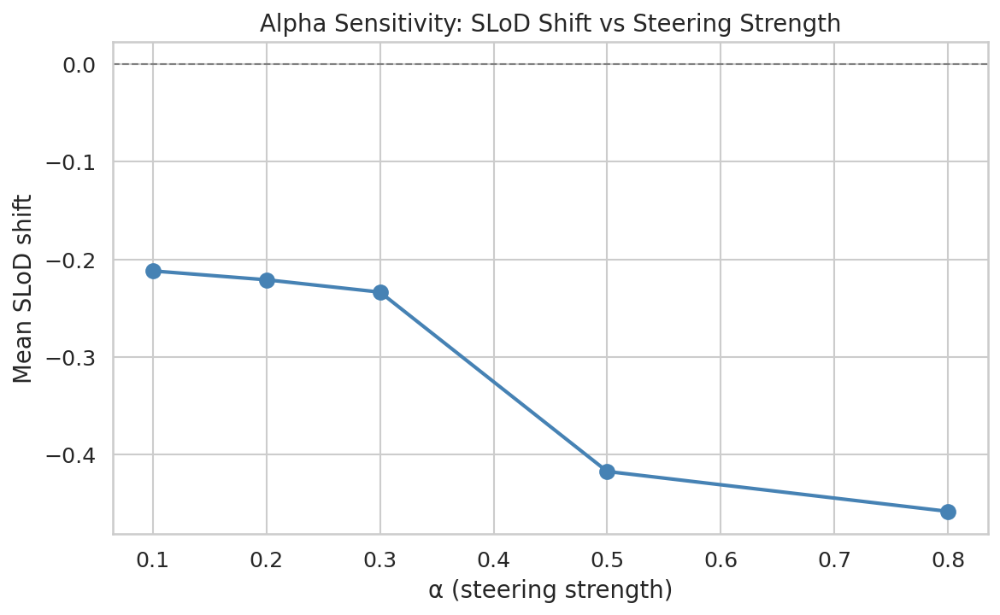
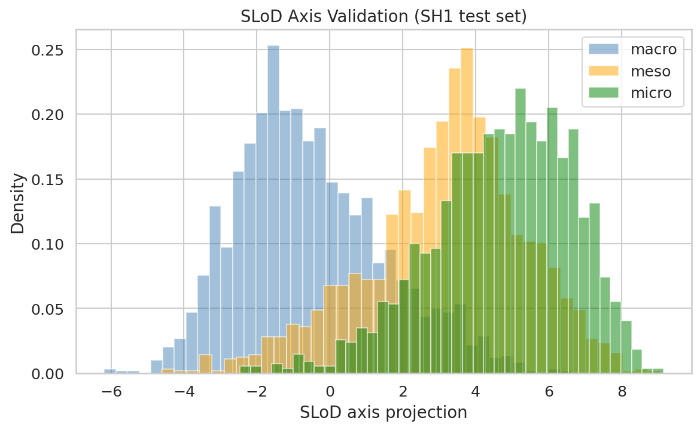

# SH2: Activation Steering Along the SLoD Axis — Results

**Date:** 2026-03-17
**Verdict:** **NOT CONFIRMED**

---

## 1. SLoD Shift (H1)

**Criterion:** paired t-test p < 0.05, Cohen's d > 0.5

### Micro Steering Direction

| Metric | Value |
|--------|-------|
| Mean Δ SLoD | -0.2548 |
| Std Δ SLoD | 1.3378 |
| p-value | 2.5069e-05 |
| Cohen's d | -0.1904 |
| H1 passed | No |

### Macro Steering Direction

| Metric | Value |
|--------|-------|
| Mean Δ SLoD | 0.1851 |
| Std Δ SLoD | 1.4941 |
| p-value | 5.8723e-03 |
| Cohen's d | 0.1239 |

---

## 2. Surface Metrics (H2)

**Criterion:** at least 2 of 4 surface metrics shift significantly (p < 0.05)

| Metric | Baseline Mean | Steered Mean | Mean Δ | p-value | Significant |
|--------|--------------|--------------|--------|---------|-------------|
| Entity Density | 0.0167 | 0.0156 | -0.0011 | 3.6479e-01 | No |
| Citation Density | 0.0001 | 0.0003 | 0.0003 | 2.9999e-01 | No |
| Numeric Density | 0.0416 | 0.0386 | -0.0030 | 2.1618e-01 | No |
| Mean Sentence Length | 16.9660 | 17.4149 | 0.4489 | 2.0769e-01 | No |

**Significant metrics: 0/4** — H2 FAILED

---

## 3. Factuality Preservation (H3)

**Criterion:** token-F1 drop ≤ 0.05 vs baseline

| Condition | Mean Token-F1 |
|-----------|--------------|
| Baseline | 0.2712 |
| Steered (micro) | 0.2648 |
| Drop | -0.0065 |
| H3 passed | Yes |

---

## 4. Layer and Alpha Selection

- **Selected layer:** 8
- **Selected alpha:** 0.8

---

## 5. SLoD Axis Validation

---

## 6. Comparison with SH Family Baselines

| Metric | SH5d Baseline | SH2 Result |
|--------|--------------|------------|
| SciBERT SLoD Cohen's d | 2.65 | -0.1904 |
| SH1 probe macro-F1 | 0.72 | — |
| SH5d SLoD axis ρ | 0.219 | — |

---

## 7. Interpretation

The steering experiment was **NOT CONFIRMED**. The SLoD shift (H1) did not reach the required
significance threshold (p < 0.05, Cohen's d > 0.5).

Possible explanations include insufficient α values, suboptimal layer selection, or the SLoD axis
being less distinct in the generative model's hidden states compared to SciBERT's encoder space.

---

*Generated automatically by SH2 pipeline on 2026-03-17.*