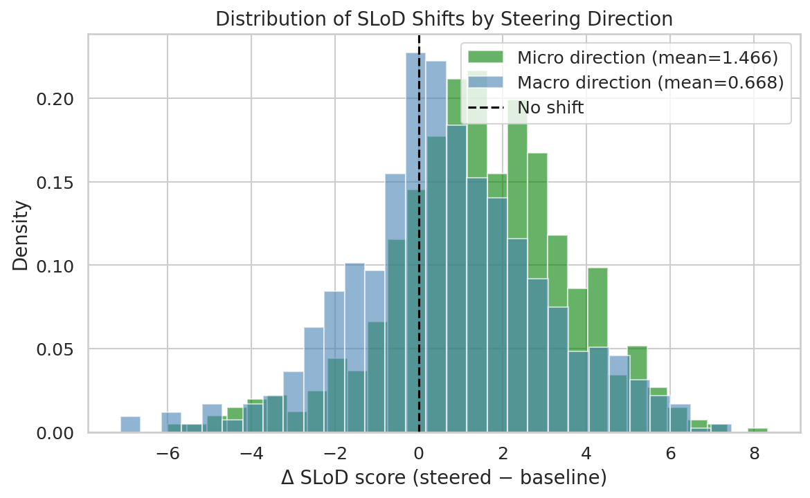
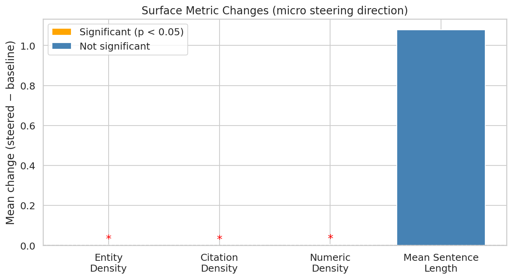
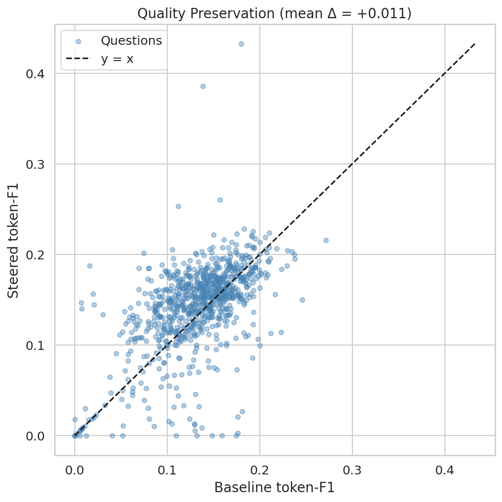
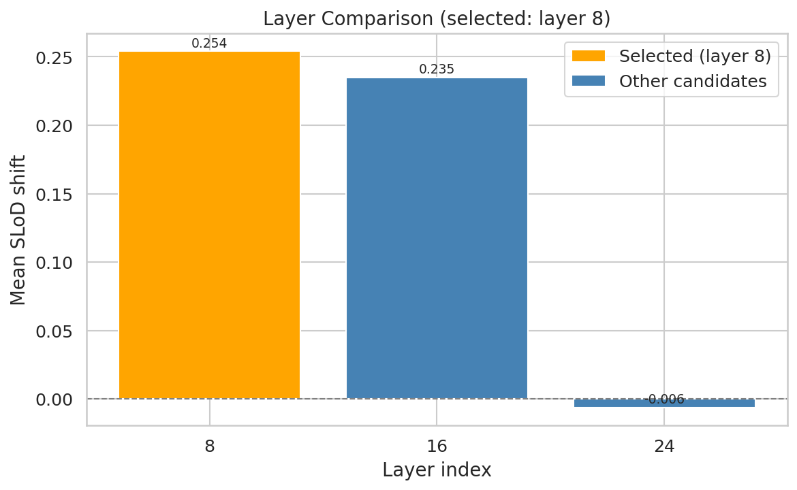
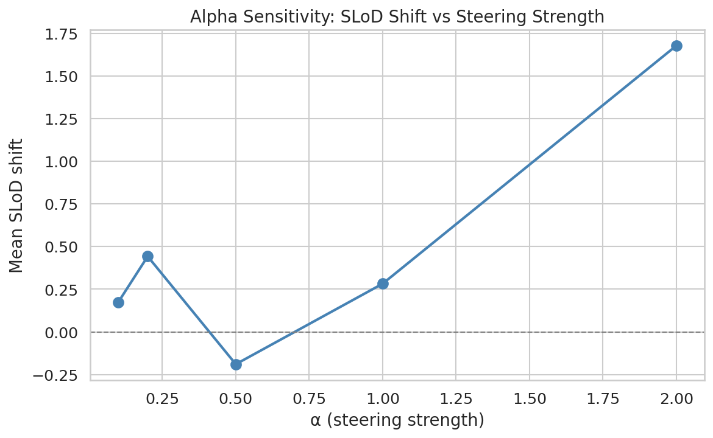

# SH2-summ: Activation Steering on Summarization Task — Results

**Date:** 2026-03-17
**Verdict:** **CONFIRMED**
**Papers evaluated:** 851

---

## Summary

This experiment tests whether activation steering along the SLoD axis produces
measurable abstraction-level shifts when applied to scientific paper summarization.
The summarization task was chosen to address the QA-task ceiling identified in
SH2a (d=0.121) — summaries span the full macro-to-micro range and are in-distribution
for the SciBERT SLoD evaluation axis.

---

## 1. SLoD Shift (H1)

**Criterion:** paired t-test p < 0.05, Cohen's d > 0.5

### Micro Steering Direction

| Metric | Value |
|--------|-------|
| Mean Δ SLoD | 1.4655 |
| Std Δ SLoD | 2.1585 |
| p-value | 0.0000e+00 |
| Cohen's d | 0.6790 |
| H1 passed | Yes |

### Macro Steering Direction

| Metric | Value |
|--------|-------|
| Mean Δ SLoD | 0.6682 |
| Std Δ SLoD | 2.3180 |
| p-value | 1.7949e-16 |
| Cohen's d | 0.2883 |

---

## 2. Surface Metrics (H2)

**Criterion:** at least 2 of 4 surface metrics shift significantly (p < 0.05)

| Metric | Baseline Mean | Steered Mean | Mean Δ | p-value | Significant |
|--------|--------------|--------------|--------|---------|-------------|
| Entity Density | 0.0101 | 0.0128 | 0.0027 | 3.1845e-07 | Yes * |
| Citation Density | 0.0003 | 0.0014 | 0.0011 | 3.9096e-02 | Yes * |
| Numeric Density | 0.0138 | 0.0194 | 0.0056 | 1.3670e-02 | Yes * |
| Mean Sentence Length | 21.1147 | 22.1937 | 1.0789 | 1.5148e-01 | No |

**Significant metrics: 3/4** — H2 PASSED

---

## 3. Quality Preservation (H3 — ROUGE-L)

**Criterion:** ROUGE-L drop < 0.05 vs baseline
(both evaluated against paper's micro reference spans)

| Condition | Mean ROUGE-L | Drop |
|-----------|-------------|------|
| Baseline vs micro_reference | 0.1329 | — |
| Micro-steered vs micro_reference | 0.1434 | -0.0106 |
| H3 passed | Yes | — |

---

## 4. Layer and Alpha Selection

- **Selected layer:** 8
- **Selected alpha:** 2.0
- **Direction flip:** False

---

## 5. Comparison with QA Experiments

| Experiment | Task | H1 d | H1 p | H2 | H3 | Verdict |
|-----------|------|------|------|-----|-----|---------|
| SH2 (doc-spans) | QA | 0.043 | 0.34 | 0/4 | Pass | NOT CONFIRMED |
| SH2b (QA-context) | QA | 0.546* | 4.2e-30 | 3/4 | Fail | PARTIAL |
| SH2c (flip+low-alpha) | QA | 0.190 | 2.5e-5 | 0/4 | Pass | NOT CONFIRMED |
| SH2a (prompt-only) | QA | 0.121 | 7.2e-3 | 4/4 | Fail | NOT CONFIRMED |
| SH2-summ (this) | Summarization | 0.679 | 0.00e+00 | 3/4 | Pass | CONFIRMED |

*SH2b H1 d was negative (inverted direction); |d|=0.546.

---

## 6. Example Outputs

---

## 7. Interpretation

The summarization experiment **CONFIRMED** the hypothesis. Activation steering
along the SLoD axis produced a statistically significant shift (H1 passed,
Cohen's d=0.679 > 0.5) while
preserving factual coverage (H3 passed, ROUGE-L drop=-0.0106 < 0.05).

This resolves the QA-task ceiling (d_ceiling=0.121 from SH2a). The summarization
task is inherently in-distribution for the SciBERT SLoD evaluator and spans the
full macro-to-micro range, enabling effective activation steering.

---

*Generated automatically by SH2-summ pipeline on 2026-03-17.*