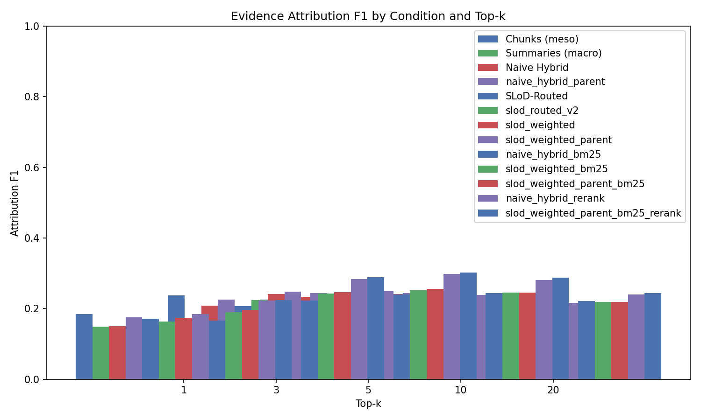
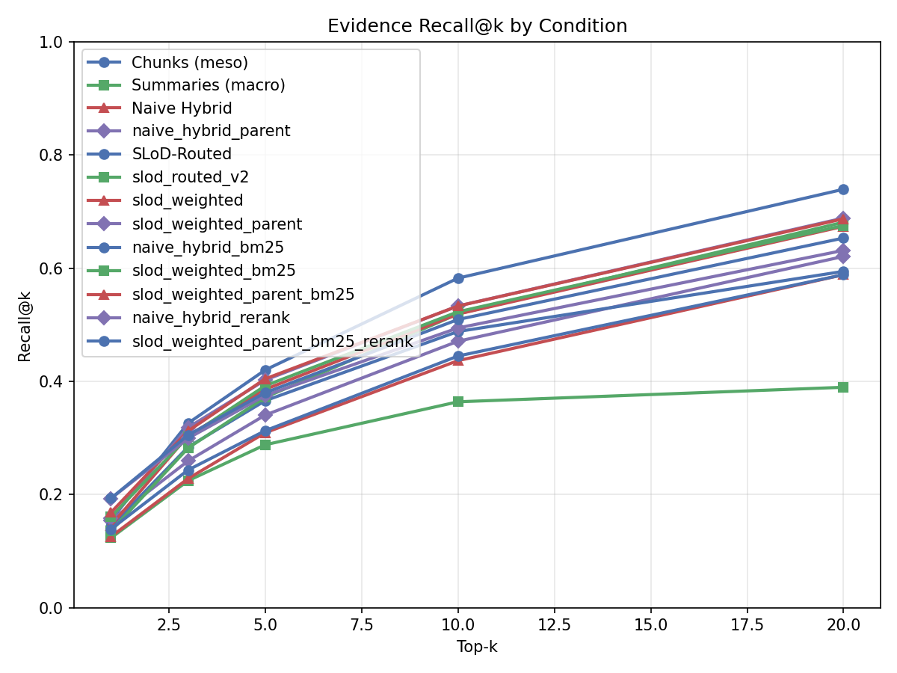
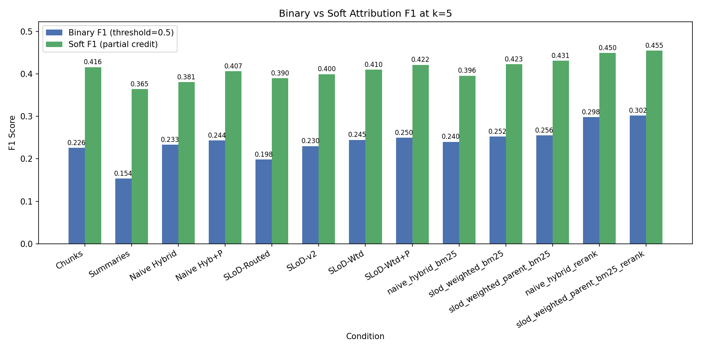
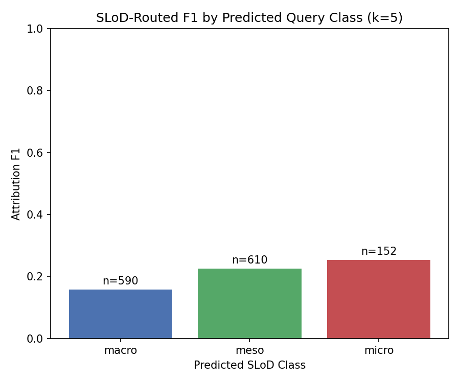
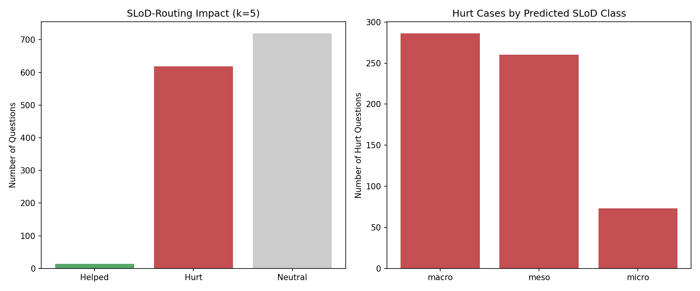

# SH3 Results: SLoD-Routed Hierarchical RAG

## 1. Main Results: Attribution F1 by Condition and Top-k

| Condition | k=1 | k=3 | k=5 | k=10 | k=20 |
|---|---|---|---|---|---|
| Chunks (meso) | 0.1851 | 0.2370 | 0.2258 | 0.1964 | 0.1508 |
| Summaries (macro) | 0.1483 | 0.1634 | 0.1537 | 0.1235 | 0.1051 |
| Naive Hybrid | 0.1507 | 0.2084 | 0.2332 | 0.2407 | 0.2170 |
| Naive Hybrid+Parent | 0.1749 | 0.2258 | 0.2437 | 0.2439 | 0.2152 |
| SLoD-Routed | 0.1714 | 0.2073 | 0.1985 | 0.1695 | 0.1373 |
| SLoD-Routed-v2 | 0.1634 | 0.2240 | 0.2300 | 0.2177 | 0.1821 |
| SLoD-Weighted | 0.1744 | 0.2415 | 0.2449 | 0.2382 | 0.2176 |
| **SLoD-Weighted+Parent** | 0.1843 | 0.2476 | 0.2496 | 0.2388 | 0.2161 |
| naive_hybrid_bm25 | 0.1656 | 0.2225 | 0.2401 | 0.2446 | 0.2209 |
| slod_weighted_bm25 | 0.1903 | 0.2430 | 0.2524 | 0.2449 | 0.2193 |
| slod_weighted_parent_bm25 | 0.1968 | 0.2471 | 0.2555 | 0.2449 | 0.2183 |
| naive_hybrid_rerank | 0.2227 | 0.2837 | 0.2983 | 0.2814 | 0.2395 |
| slod_weighted_parent_bm25_rerank | 0.2238 | 0.2889 | 0.3018 | 0.2876 | 0.2438 |

## 2. Recall@k

| Condition | k=1 | k=3 | k=5 | k=10 | k=20 |
|---|---|---|---|---|---|
| Chunks (meso) | 0.1545 | 0.3259 | 0.4200 | 0.5824 | 0.7395 |
| Summaries (macro) | 0.1232 | 0.2243 | 0.2879 | 0.3638 | 0.3895 |
| Naive Hybrid | 0.1255 | 0.2281 | 0.3091 | 0.4366 | 0.5885 |
| Naive Hybrid+Parent | 0.1541 | 0.2593 | 0.3403 | 0.4708 | 0.6208 |
| SLoD-Routed | 0.1432 | 0.2839 | 0.3658 | 0.4881 | 0.5944 |
| SLoD-Routed-v2 | 0.1354 | 0.2821 | 0.3716 | 0.5192 | 0.6813 |
| SLoD-Weighted | 0.1453 | 0.3039 | 0.3858 | 0.5189 | 0.6740 |
| **SLoD-Weighted+Parent** | 0.1577 | 0.3183 | 0.4023 | 0.5332 | 0.6886 |
| naive_hybrid_bm25 | 0.1386 | 0.2433 | 0.3127 | 0.4447 | 0.5885 |
| slod_weighted_bm25 | 0.1606 | 0.3018 | 0.3921 | 0.5229 | 0.6755 |
| slod_weighted_parent_bm25 | 0.1681 | 0.3122 | 0.4044 | 0.5331 | 0.6873 |
| naive_hybrid_rerank | 0.1929 | 0.2993 | 0.3749 | 0.4943 | 0.6315 |
| slod_weighted_parent_bm25_rerank | 0.1932 | 0.3050 | 0.3798 | 0.5093 | 0.6533 |

## 3. Mean Reciprocal Rank

| Condition | k=1 | k=3 | k=5 | k=10 | k=20 |
|---|---|---|---|---|---|
| Chunks (meso) | 0.2892 | 0.3989 | 0.4250 | 0.4441 | 0.4522 |
| Summaries (macro) | 0.2359 | 0.3119 | 0.3333 | 0.3467 | 0.3486 |
| Naive Hybrid | 0.2374 | 0.3071 | 0.3330 | 0.3525 | 0.3618 |
| Naive Hybrid+Parent | 0.2615 | 0.3184 | 0.3395 | 0.3553 | 0.3631 |
| SLoD-Routed | 0.2692 | 0.3628 | 0.3870 | 0.4040 | 0.4098 |
| SLoD-Routed-v2 | 0.2604 | 0.3519 | 0.3781 | 0.3975 | 0.4064 |
| SLoD-Weighted | 0.2751 | 0.3771 | 0.4009 | 0.4176 | 0.4265 |
| **SLoD-Weighted+Parent** | 0.2844 | 0.3818 | 0.4040 | 0.4187 | 0.4271 |
| naive_hybrid_bm25 | 0.2596 | 0.3274 | 0.3496 | 0.3702 | 0.3795 |
| slod_weighted_bm25 | 0.2929 | 0.3849 | 0.4100 | 0.4276 | 0.4362 |
| slod_weighted_parent_bm25 | 0.2992 | 0.3882 | 0.4123 | 0.4284 | 0.4366 |
| naive_hybrid_rerank | 0.3188 | 0.3907 | 0.4151 | 0.4333 | 0.4416 |
| slod_weighted_parent_bm25_rerank | 0.3225 | 0.3966 | 0.4208 | 0.4403 | 0.4487 |

## 4. Mean Token Cost

| Condition | k=1 | k=3 | k=5 | k=10 | k=20 |
|---|---|---|---|---|---|
| Chunks (meso) | 73 | 236 | 405 | 829 | 1642 |
| Summaries (macro) | 83 | 263 | 453 | 872 | 1222 |
| Naive Hybrid | 48 | 160 | 280 | 599 | 1261 |
| Naive Hybrid+Parent | 113 | 273 | 439 | 839 | 1602 |
| SLoD-Routed | 75 | 238 | 407 | 804 | 1381 |
| SLoD-Routed-v2 | 60 | 198 | 343 | 713 | 1446 |
| SLoD-Weighted | 64 | 198 | 337 | 681 | 1374 |
| **SLoD-Weighted+Parent** | 83 | 246 | 411 | 797 | 1547 |
| naive_hybrid_bm25 | 58 | 188 | 325 | 676 | 1391 |
| slod_weighted_bm25 | 75 | 223 | 374 | 750 | 1498 |
| slod_weighted_parent_bm25 | 91 | 262 | 431 | 846 | 1635 |
| naive_hybrid_rerank | 71 | 226 | 376 | 761 | 1485 |
| slod_weighted_parent_bm25_rerank | 72 | 230 | 387 | 792 | 1572 |

## 5. Soft Attribution F1 (Partial Credit)

Soft F1 gives proportional credit for partial overlaps instead of binary match/no-match.

| Condition | k=1 | k=3 | k=5 | k=10 | k=20 |
|---|---|---|---|---|---|
| Chunks (meso) | 0.3454 | 0.4095 | 0.4163 | 0.4187 | 0.4080 |
| Summaries (macro) | 0.3261 | 0.3610 | 0.3646 | 0.3561 | 0.3467 |
| Naive Hybrid | 0.2841 | 0.3509 | 0.3809 | 0.4039 | 0.4088 |
| Naive Hybrid+Parent | 0.3289 | 0.3839 | 0.4070 | 0.4210 | 0.4194 |
| SLoD-Routed | 0.3313 | 0.3842 | 0.3901 | 0.3879 | 0.3794 |
| SLoD-Routed-v2 | 0.3121 | 0.3812 | 0.3997 | 0.4107 | 0.4081 |
| SLoD-Weighted | 0.3263 | 0.3972 | 0.4105 | 0.4219 | 0.4244 |
| **SLoD-Weighted+Parent** | 0.3414 | 0.4097 | 0.4217 | 0.4290 | 0.4291 |
| naive_hybrid_bm25 | 0.3099 | 0.3722 | 0.3960 | 0.4141 | 0.4187 |
| slod_weighted_bm25 | 0.3510 | 0.4065 | 0.4229 | 0.4321 | 0.4325 |
| slod_weighted_parent_bm25 | 0.3623 | 0.4155 | 0.4312 | 0.4373 | 0.4360 |
| naive_hybrid_rerank | 0.3640 | 0.4309 | 0.4496 | 0.4510 | 0.4396 |
| slod_weighted_parent_bm25_rerank | 0.3663 | 0.4366 | 0.4550 | 0.4588 | 0.4485 |

### Soft Precision and Recall (k=5)

| Condition | Soft Precision | Soft Recall | Soft F1 |
|-----------|---------------|-------------|---------|
| Chunks (meso) | 0.3560 | 0.5580 | 0.4163 |
| Summaries (macro) | 0.3204 | 0.4679 | 0.3646 |
| Naive Hybrid | 0.3656 | 0.4363 | 0.3809 |
| Naive Hybrid+Parent | 0.3767 | 0.4915 | 0.4070 |
| SLoD-Routed | 0.3378 | 0.5125 | 0.3901 |
| SLoD-Routed-v2 | 0.3590 | 0.5019 | 0.3997 |
| SLoD-Weighted | 0.3662 | 0.5188 | 0.4105 |
| **SLoD-Weighted+Parent** | 0.3717 | 0.5431 | 0.4217 |
| naive_hybrid_bm25 | 0.3810 | 0.4491 | 0.3960 |
| slod_weighted_bm25 | 0.3805 | 0.5266 | 0.4229 |
| slod_weighted_parent_bm25 | 0.3842 | 0.5448 | 0.4312 |
| naive_hybrid_rerank | 0.4361 | 0.5041 | 0.4496 |
| slod_weighted_parent_bm25_rerank | 0.4399 | 0.5116 | 0.4550 |

### Soft vs Binary F1 Lift (k=5)

| Condition | Binary F1 | Soft F1 | Lift |
|-----------|-----------|---------|------|
| Chunks (meso) | 0.2258 | 0.4163 | +0.1904 |
| Summaries (macro) | 0.1537 | 0.3646 | +0.2109 |
| Naive Hybrid | 0.2332 | 0.3809 | +0.1477 |
| Naive Hybrid+Parent | 0.2437 | 0.4070 | +0.1632 |
| SLoD-Routed | 0.1985 | 0.3901 | +0.1916 |
| SLoD-Routed-v2 | 0.2300 | 0.3997 | +0.1697 |
| SLoD-Weighted | 0.2449 | 0.4105 | +0.1656 |
| **SLoD-Weighted+Parent** | 0.2496 | 0.4217 | +0.1721 |
| naive_hybrid_bm25 | 0.2401 | 0.3960 | +0.1559 |
| slod_weighted_bm25 | 0.2524 | 0.4229 | +0.1706 |
| slod_weighted_parent_bm25 | 0.2555 | 0.4312 | +0.1757 |
| naive_hybrid_rerank | 0.2983 | 0.4496 | +0.1512 |
| slod_weighted_parent_bm25_rerank | 0.3018 | 0.4550 | +0.1532 |

## 6. Statistical Significance (Bootstrap Tests)

SLoD-Routed vs each baseline on Attribution F1:

| k | Baseline | Diff | p-value | 95% CI | Significant |
|---|---------|------|---------|--------|-------------|
| 1 | Chunks (meso) | -0.0136 | 0.0118 | [-0.0256, -0.0018] | Yes |
| 1 | Summaries (macro) | 0.0231 | 0.0005 | [0.0100, 0.0364] | Yes |
| 1 | Naive Hybrid | 0.0207 | 0.0074 | [0.0039, 0.0377] | Yes |
| 1 | Naive Hybrid+Parent | -0.0034 | 0.3482 | [-0.0196, 0.0130] | No |
| 1 | SLoD-Routed-v2 | 0.0080 | 0.1259 | [-0.0057, 0.0216] | No |
| 1 | SLoD-Weighted | -0.0030 | 0.3214 | [-0.0156, 0.0097] | No |
| 1 | **SLoD-Weighted+Parent** | -0.0129 | 0.0230 | [-0.0256, -0.0002] | Yes |
| 1 | naive_hybrid_bm25 | 0.0058 | 0.2773 | [-0.0129, 0.0242] | No |
| 1 | slod_weighted_bm25 | -0.0188 | 0.0122 | [-0.0357, -0.0024] | Yes |
| 1 | slod_weighted_parent_bm25 | -0.0254 | 0.0010 | [-0.0422, -0.0091] | Yes |
| 1 | naive_hybrid_rerank | -0.0513 | 0.0000 | [-0.0726, -0.0301] | Yes |
| 1 | slod_weighted_parent_bm25_rerank | -0.0523 | 0.0000 | [-0.0738, -0.0307] | Yes |
| 3 | Chunks (meso) | -0.0297 | 0.0000 | [-0.0395, -0.0197] | Yes |
| 3 | Summaries (macro) | 0.0439 | 0.0000 | [0.0333, 0.0549] | Yes |
| 3 | Naive Hybrid | -0.0010 | 0.4426 | [-0.0152, 0.0128] | No |
| 3 | Naive Hybrid+Parent | -0.0185 | 0.0040 | [-0.0322, -0.0049] | Yes |
| 3 | SLoD-Routed-v2 | -0.0166 | 0.0013 | [-0.0281, -0.0057] | Yes |
| 3 | SLoD-Weighted | -0.0341 | 0.0000 | [-0.0452, -0.0230] | Yes |
| 3 | **SLoD-Weighted+Parent** | -0.0402 | 0.0000 | [-0.0515, -0.0293] | Yes |
| 3 | naive_hybrid_bm25 | -0.0151 | 0.0255 | [-0.0307, 0.0000] | Yes |
| 3 | slod_weighted_bm25 | -0.0356 | 0.0000 | [-0.0487, -0.0227] | Yes |
| 3 | slod_weighted_parent_bm25 | -0.0398 | 0.0000 | [-0.0530, -0.0268] | Yes |
| 3 | naive_hybrid_rerank | -0.0763 | 0.0000 | [-0.0939, -0.0588] | Yes |
| 3 | slod_weighted_parent_bm25_rerank | -0.0816 | 0.0000 | [-0.0993, -0.0638] | Yes |
| 5 | Chunks (meso) | -0.0273 | 0.0000 | [-0.0356, -0.0192] | Yes |
| 5 | Summaries (macro) | 0.0448 | 0.0000 | [0.0360, 0.0540] | Yes |
| 5 | Naive Hybrid | -0.0347 | 0.0000 | [-0.0477, -0.0219] | Yes |
| 5 | Naive Hybrid+Parent | -0.0452 | 0.0000 | [-0.0578, -0.0329] | Yes |
| 5 | SLoD-Routed-v2 | -0.0315 | 0.0000 | [-0.0416, -0.0217] | Yes |
| 5 | SLoD-Weighted | -0.0464 | 0.0000 | [-0.0569, -0.0361] | Yes |
| 5 | **SLoD-Weighted+Parent** | -0.0511 | 0.0000 | [-0.0615, -0.0409] | Yes |
| 5 | naive_hybrid_bm25 | -0.0416 | 0.0000 | [-0.0555, -0.0277] | Yes |
| 5 | slod_weighted_bm25 | -0.0539 | 0.0000 | [-0.0652, -0.0427] | Yes |
| 5 | slod_weighted_parent_bm25 | -0.0570 | 0.0000 | [-0.0681, -0.0460] | Yes |
| 5 | naive_hybrid_rerank | -0.0998 | 0.0000 | [-0.1149, -0.0846] | Yes |
| 5 | slod_weighted_parent_bm25_rerank | -0.1033 | 0.0000 | [-0.1185, -0.0879] | Yes |
| 10 | Chunks (meso) | -0.0269 | 0.0000 | [-0.0334, -0.0206] | Yes |
| 10 | Summaries (macro) | 0.0460 | 0.0000 | [0.0390, 0.0532] | Yes |
| 10 | Naive Hybrid | -0.0712 | 0.0000 | [-0.0824, -0.0607] | Yes |
| 10 | Naive Hybrid+Parent | -0.0744 | 0.0000 | [-0.0847, -0.0645] | Yes |
| 10 | SLoD-Routed-v2 | -0.0482 | 0.0000 | [-0.0569, -0.0400] | Yes |
| 10 | SLoD-Weighted | -0.0687 | 0.0000 | [-0.0778, -0.0601] | Yes |
| 10 | **SLoD-Weighted+Parent** | -0.0693 | 0.0000 | [-0.0783, -0.0608] | Yes |
| 10 | naive_hybrid_bm25 | -0.0751 | 0.0000 | [-0.0862, -0.0642] | Yes |
| 10 | slod_weighted_bm25 | -0.0754 | 0.0000 | [-0.0851, -0.0662] | Yes |
| 10 | slod_weighted_parent_bm25 | -0.0754 | 0.0000 | [-0.0849, -0.0663] | Yes |
| 10 | naive_hybrid_rerank | -0.1119 | 0.0000 | [-0.1230, -0.1008] | Yes |
| 10 | slod_weighted_parent_bm25_rerank | -0.1181 | 0.0000 | [-0.1294, -0.1068] | Yes |
| 20 | Chunks (meso) | -0.0136 | 0.0000 | [-0.0183, -0.0089] | Yes |
| 20 | Summaries (macro) | 0.0321 | 0.0000 | [0.0270, 0.0375] | Yes |
| 20 | Naive Hybrid | -0.0797 | 0.0000 | [-0.0879, -0.0718] | Yes |
| 20 | Naive Hybrid+Parent | -0.0779 | 0.0000 | [-0.0855, -0.0706] | Yes |
| 20 | SLoD-Routed-v2 | -0.0448 | 0.0000 | [-0.0512, -0.0385] | Yes |
| 20 | SLoD-Weighted | -0.0803 | 0.0000 | [-0.0875, -0.0733] | Yes |
| 20 | **SLoD-Weighted+Parent** | -0.0788 | 0.0000 | [-0.0859, -0.0719] | Yes |
| 20 | naive_hybrid_bm25 | -0.0836 | 0.0000 | [-0.0917, -0.0755] | Yes |
| 20 | slod_weighted_bm25 | -0.0821 | 0.0000 | [-0.0892, -0.0750] | Yes |
| 20 | slod_weighted_parent_bm25 | -0.0811 | 0.0000 | [-0.0881, -0.0741] | Yes |
| 20 | naive_hybrid_rerank | -0.1023 | 0.0000 | [-0.1100, -0.0944] | Yes |
| 20 | slod_weighted_parent_bm25_rerank | -0.1066 | 0.0000 | [-0.1143, -0.0988] | Yes |

## 7. Statistical Significance — Soft F1 (Bootstrap Tests)

**SLoD-Weighted+Parent** vs each baseline on Soft Attribution F1:

| k | Baseline | Diff | p-value | 95% CI | Significant |
|---|---------|------|---------|--------|-------------|
| 1 | Chunks (meso) | -0.0040 | 0.1170 | [-0.0105, 0.0025] | No |
| 1 | Summaries (macro) | 0.0153 | 0.0232 | [0.0002, 0.0301] | Yes |
| 1 | Naive Hybrid | 0.0574 | 0.0000 | [0.0470, 0.0678] | Yes |
| 1 | Naive Hybrid+Parent | 0.0126 | 0.0068 | [0.0025, 0.0229] | Yes |
| 1 | SLoD-Routed | 0.0102 | 0.0316 | [-0.0006, 0.0210] | Yes |
| 1 | SLoD-Routed-v2 | 0.0293 | 0.0000 | [0.0210, 0.0379] | Yes |
| 1 | SLoD-Weighted | 0.0152 | 0.0000 | [0.0120, 0.0186] | Yes |
| 1 | naive_hybrid_bm25 | 0.0315 | 0.0000 | [0.0184, 0.0445] | Yes |
| 1 | slod_weighted_bm25 | -0.0096 | 0.0697 | [-0.0225, 0.0030] | No |
| 1 | slod_weighted_parent_bm25 | -0.0209 | 0.0001 | [-0.0337, -0.0085] | Yes |
| 1 | naive_hybrid_rerank | -0.0226 | 0.0031 | [-0.0388, -0.0066] | Yes |
| 1 | slod_weighted_parent_bm25_rerank | -0.0249 | 0.0014 | [-0.0412, -0.0085] | Yes |
| 3 | Chunks (meso) | 0.0002 | 0.4850 | [-0.0062, 0.0067] | No |
| 3 | Summaries (macro) | 0.0487 | 0.0000 | [0.0372, 0.0610] | Yes |
| 3 | Naive Hybrid | 0.0588 | 0.0000 | [0.0505, 0.0669] | Yes |
| 3 | Naive Hybrid+Parent | 0.0258 | 0.0000 | [0.0178, 0.0337] | Yes |
| 3 | SLoD-Routed | 0.0255 | 0.0000 | [0.0165, 0.0345] | Yes |
| 3 | SLoD-Routed-v2 | 0.0285 | 0.0000 | [0.0217, 0.0354] | Yes |
| 3 | SLoD-Weighted | 0.0125 | 0.0000 | [0.0099, 0.0153] | Yes |
| 3 | naive_hybrid_bm25 | 0.0375 | 0.0000 | [0.0275, 0.0471] | Yes |
| 3 | slod_weighted_bm25 | 0.0032 | 0.2316 | [-0.0053, 0.0115] | No |
| 3 | slod_weighted_parent_bm25 | -0.0058 | 0.0821 | [-0.0140, 0.0024] | No |
| 3 | naive_hybrid_rerank | -0.0212 | 0.0010 | [-0.0341, -0.0079] | Yes |
| 3 | slod_weighted_parent_bm25_rerank | -0.0269 | 0.0000 | [-0.0400, -0.0134] | Yes |
| 5 | Chunks (meso) | 0.0055 | 0.0334 | [-0.0004, 0.0113] | Yes |
| 5 | Summaries (macro) | 0.0571 | 0.0000 | [0.0468, 0.0680] | Yes |
| 5 | Naive Hybrid | 0.0408 | 0.0000 | [0.0339, 0.0474] | Yes |
| 5 | Naive Hybrid+Parent | 0.0148 | 0.0000 | [0.0084, 0.0209] | Yes |
| 5 | SLoD-Routed | 0.0316 | 0.0000 | [0.0234, 0.0398] | Yes |
| 5 | SLoD-Routed-v2 | 0.0220 | 0.0000 | [0.0161, 0.0279] | Yes |
| 5 | SLoD-Weighted | 0.0113 | 0.0000 | [0.0090, 0.0136] | Yes |
| 5 | naive_hybrid_bm25 | 0.0258 | 0.0000 | [0.0174, 0.0339] | Yes |
| 5 | slod_weighted_bm25 | -0.0012 | 0.3567 | [-0.0074, 0.0051] | No |
| 5 | slod_weighted_parent_bm25 | -0.0094 | 0.0009 | [-0.0156, -0.0034] | Yes |
| 5 | naive_hybrid_rerank | -0.0278 | 0.0000 | [-0.0388, -0.0167] | Yes |
| 5 | slod_weighted_parent_bm25_rerank | -0.0332 | 0.0000 | [-0.0445, -0.0217] | Yes |
| 10 | Chunks (meso) | 0.0103 | 0.0000 | [0.0049, 0.0156] | Yes |
| 10 | Summaries (macro) | 0.0729 | 0.0000 | [0.0641, 0.0820] | Yes |
| 10 | Naive Hybrid | 0.0251 | 0.0000 | [0.0202, 0.0300] | Yes |
| 10 | Naive Hybrid+Parent | 0.0080 | 0.0004 | [0.0035, 0.0125] | Yes |
| 10 | SLoD-Routed | 0.0411 | 0.0000 | [0.0343, 0.0483] | Yes |
| 10 | SLoD-Routed-v2 | 0.0183 | 0.0000 | [0.0137, 0.0230] | Yes |
| 10 | SLoD-Weighted | 0.0071 | 0.0000 | [0.0054, 0.0088] | Yes |
| 10 | naive_hybrid_bm25 | 0.0149 | 0.0000 | [0.0089, 0.0206] | Yes |
| 10 | slod_weighted_bm25 | -0.0031 | 0.0866 | [-0.0077, 0.0014] | No |
| 10 | slod_weighted_parent_bm25 | -0.0083 | 0.0001 | [-0.0127, -0.0040] | Yes |
| 10 | naive_hybrid_rerank | -0.0219 | 0.0000 | [-0.0293, -0.0144] | Yes |
| 10 | slod_weighted_parent_bm25_rerank | -0.0298 | 0.0000 | [-0.0376, -0.0220] | Yes |
| 20 | Chunks (meso) | 0.0212 | 0.0000 | [0.0165, 0.0256] | Yes |
| 20 | Summaries (macro) | 0.0824 | 0.0000 | [0.0754, 0.0897] | Yes |
| 20 | Naive Hybrid | 0.0204 | 0.0000 | [0.0172, 0.0236] | Yes |
| 20 | Naive Hybrid+Parent | 0.0097 | 0.0000 | [0.0068, 0.0127] | Yes |
| 20 | SLoD-Routed | 0.0497 | 0.0000 | [0.0438, 0.0557] | Yes |
| 20 | SLoD-Routed-v2 | 0.0210 | 0.0000 | [0.0172, 0.0247] | Yes |
| 20 | SLoD-Weighted | 0.0047 | 0.0000 | [0.0035, 0.0060] | Yes |
| 20 | naive_hybrid_bm25 | 0.0105 | 0.0000 | [0.0065, 0.0146] | Yes |
| 20 | slod_weighted_bm25 | -0.0034 | 0.0183 | [-0.0066, -0.0002] | Yes |
| 20 | slod_weighted_parent_bm25 | -0.0069 | 0.0000 | [-0.0099, -0.0038] | Yes |
| 20 | naive_hybrid_rerank | -0.0104 | 0.0000 | [-0.0149, -0.0059] | Yes |
| 20 | slod_weighted_parent_bm25_rerank | -0.0193 | 0.0000 | [-0.0242, -0.0143] | Yes |

## 8. Breakdown by Predicted SLoD Class (k=5)

| Condition | Macro | Meso | Micro |
|-----------|-------|------|-------|
| Chunks (meso) | 0.2234 (n=590) | 0.2249 (n=610) | 0.2389 (n=152) |
| Summaries (macro) | 0.1571 (n=590) | 0.1558 (n=610) | 0.1321 (n=152) |
| Naive Hybrid | 0.2259 (n=590) | 0.2314 (n=610) | 0.2685 (n=152) |
| Naive Hybrid+Parent | 0.2365 (n=590) | 0.2431 (n=610) | 0.2745 (n=152) |
| SLoD-Routed | 0.1571 (n=590) | 0.2249 (n=610) | 0.2530 (n=152) |
| SLoD-Routed-v2 | 0.2225 (n=590) | 0.2282 (n=610) | 0.2669 (n=152) |
| SLoD-Weighted | 0.2427 (n=590) | 0.2442 (n=610) | 0.2561 (n=152) |
| **SLoD-Weighted+Parent** | 0.2463 (n=590) | 0.2494 (n=610) | 0.2633 (n=152) |
| naive_hybrid_bm25 | 0.2279 (n=590) | 0.2483 (n=610) | 0.2545 (n=152) |
| slod_weighted_bm25 | 0.2454 (n=590) | 0.2588 (n=610) | 0.2537 (n=152) |
| slod_weighted_parent_bm25 | 0.2481 (n=590) | 0.2608 (n=610) | 0.2631 (n=152) |
| naive_hybrid_rerank | 0.2857 (n=590) | 0.3136 (n=610) | 0.2862 (n=152) |
| slod_weighted_parent_bm25_rerank | 0.2879 (n=590) | 0.3173 (n=610) | 0.2931 (n=152) |

## 9. Breakdown by Answer Type (k=5)

| Condition | abstractive | extractive | yes_no |
|---|---|---|---|
| Chunks (meso) | 0.2258 (n=571) | 0.2229 (n=561) | 0.2333 (n=220) |
| Summaries (macro) | 0.1495 (n=571) | 0.1653 (n=561) | 0.1352 (n=220) |
| Naive Hybrid | 0.2334 (n=571) | 0.2334 (n=561) | 0.2322 (n=220) |
| Naive Hybrid+Parent | 0.2446 (n=571) | 0.2451 (n=561) | 0.2381 (n=220) |
| SLoD-Routed | 0.1970 (n=571) | 0.2027 (n=561) | 0.1917 (n=220) |
| SLoD-Routed-v2 | 0.2298 (n=571) | 0.2250 (n=561) | 0.2436 (n=220) |
| SLoD-Weighted | 0.2438 (n=571) | 0.2415 (n=561) | 0.2562 (n=220) |
| **SLoD-Weighted+Parent** | 0.2484 (n=571) | 0.2459 (n=561) | 0.2621 (n=220) |
| naive_hybrid_bm25 | 0.2376 (n=571) | 0.2450 (n=561) | 0.2339 (n=220) |
| slod_weighted_bm25 | 0.2497 (n=571) | 0.2549 (n=561) | 0.2527 (n=220) |
| slod_weighted_parent_bm25 | 0.2523 (n=571) | 0.2580 (n=561) | 0.2576 (n=220) |
| naive_hybrid_rerank | 0.2773 (n=571) | 0.3280 (n=561) | 0.2772 (n=220) |
| slod_weighted_parent_bm25_rerank | 0.2784 (n=571) | 0.3366 (n=561) | 0.2737 (n=220) |

## 10. Confusion Analysis

At k=5:
- **Helped:** 14 questions (mean +0.1947 F1)
- **Hurt:** 619 questions (mean -0.3049 F1)
- **Neutral:** 719 questions

Hurt cases by predicted SLoD class:
- macro: 286
- meso: 260
- micro: 73

## 11. Conclusion

**SH3 claim NOT SUPPORTED.** SLoD-routed (0.1985) does not outperform the best baseline (Naive Hybrid: 0.2332) at k=5.
