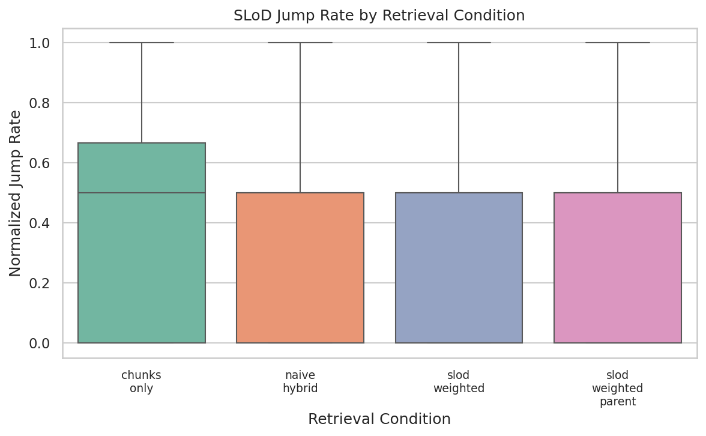
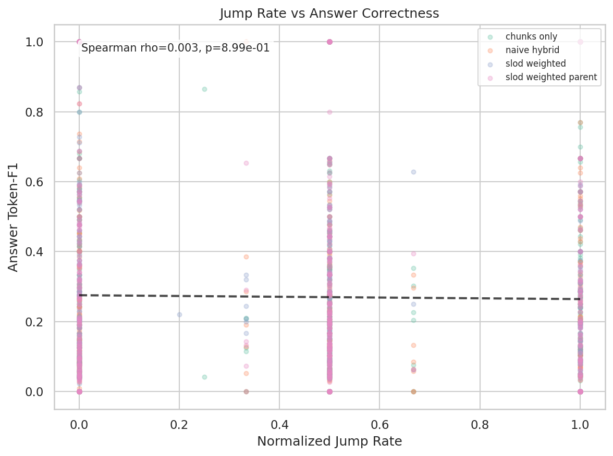
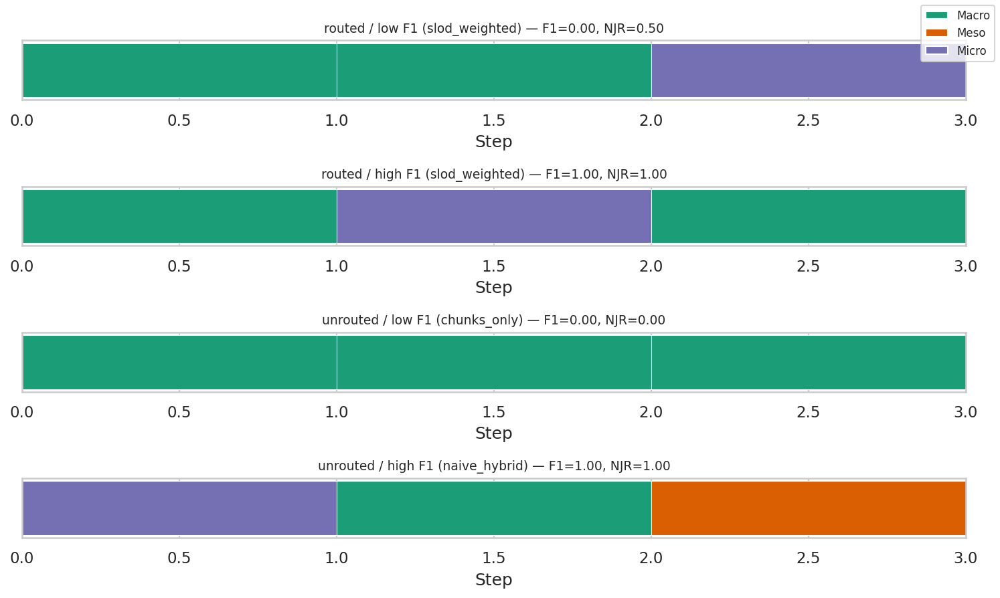
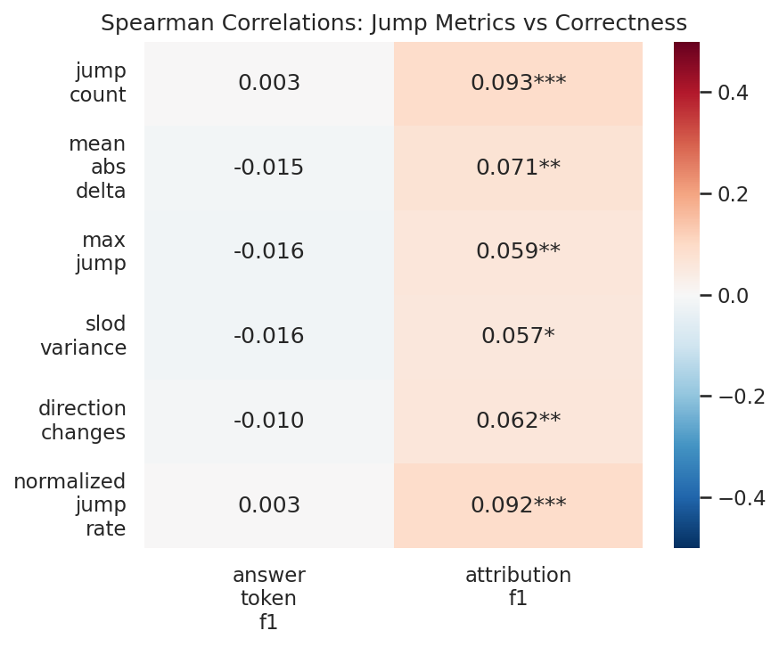
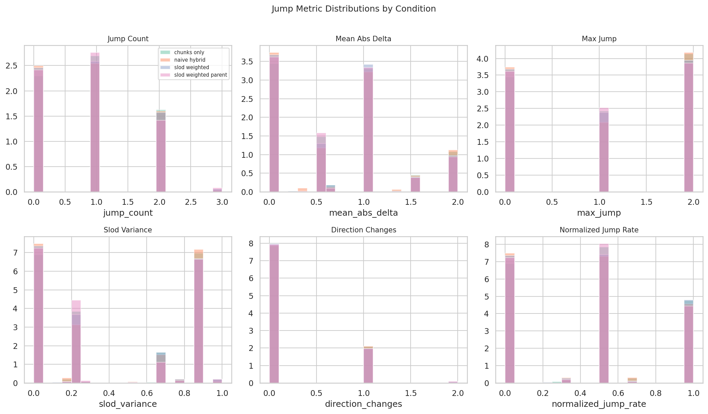
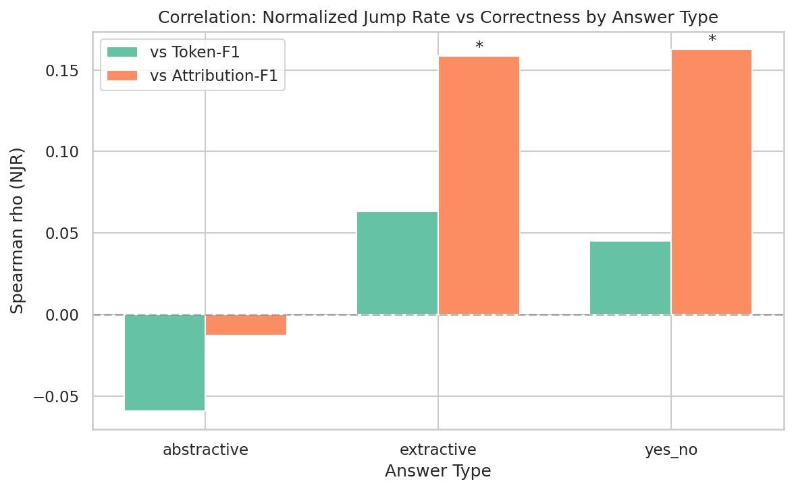

# SH5 Report: Jump Rate as Behavioral Signature
**Verdict: NOT CONFIRMED**
**Date:** 2026-03-15
---
## Executive Summary
SH5 tests whether lower abstraction-level jump rates in chain-of-thought reasoning steps correlate with higher QA correctness, and whether SLoD-routed retrieval produces more coherent (lower-jump) reasoning traces.
**Result:** Neither hypothesis is supported by the data.
- **H1 (Correlation):** Spearman rho = 0.0029, p = 8.99e-01, 95% CI = [-0.041841, 0.046612] (NOT PASSED)
- **H2 (Condition Difference):** slod_weighted NJR mean = 0.4341, chunks_only NJR mean = 0.4470, Wilcoxon p = 3.17e-01 (NOT PASSED)

---
## Data and Methodology
- **Questions sampled:** 2000 (after filtering)
- **Conditions:** chunks_only, naive_hybrid, slod_weighted, slod_weighted_parent
- **Top-k:** 5
- **CoT model:** claude-3-haiku-20240307
- **SLoD probe:** SciBERT + LogReg (C=0.01)
- **Min steps filter:** 2
- **Bootstrap resamples:** 10000

### Trace Statistics
- Total traces: 2000
- Mean steps per trace: 3.1
- Median steps per trace: 3

---
## Correlation Results
### Overall Spearman Correlations
| Jump Metric | vs Token-F1 (rho) | p-value | vs Attribution-F1 (rho) | p-value |
|---|---|---|---|---|
| jump_count | 0.0027 | 9.03e-01 | 0.0930* | 3.10e-05 |
| mean_abs_delta | -0.0153 | 4.93e-01 | 0.0712* | 1.44e-03 |
| max_jump | -0.0162 | 4.68e-01 | 0.0587* | 8.68e-03 |
| slod_variance | -0.0163 | 4.66e-01 | 0.0573* | 1.04e-02 |
| direction_changes | -0.0102 | 6.47e-01 | 0.0625* | 5.18e-03 |
| normalized_jump_rate | 0.0029 | 8.99e-01 | 0.0916* | 4.10e-05 |

*Significance: * p < 0.05*

### Correlations by Answer Type
| Answer Type | NJR vs Token-F1 (rho) | p-value | n |
|---|---|---|---|
| abstractive | -0.0593 | 8.52e-02 | 844 |
| extractive | 0.0634 | 6.80e-02 | 828 |
| yes_no | 0.0453 | 4.14e-01 | 328 |

---
## Condition Comparison
### Mean Jump Metrics by Condition
| Condition | NJR Mean | NJR Median | Mean Steps | n |
|---|---|---|---|---|
| chunks_only | 0.4470 | 0.5000 | — | 500 |
| naive_hybrid | 0.4270 | 0.5000 | — | 500 |
| slod_weighted | 0.4341 | 0.5000 | — | 500 |
| slod_weighted_parent | 0.4290 | 0.5000 | — | 500 |

### Pairwise Wilcoxon Tests (NJR)
| Comparison | Routed Mean | Unrouted Mean | Diff | p-value | Effect (r) |
|---|---|---|---|---|---|
| slod_weighted_parent_vs_chunks_only | 0.4290 | 0.4470 | -0.0180 | 2.47e-01 | 0.0833 |
| slod_weighted_parent_vs_naive_hybrid | 0.4290 | 0.4270 | 0.0020 | 9.72e-01 | 0.0023 |
| slod_weighted_vs_chunks_only | 0.4341 | 0.4470 | -0.0129 | 3.17e-01 | 0.0739 |
| slod_weighted_vs_naive_hybrid | 0.4341 | 0.4270 | 0.0071 | 7.86e-01 | 0.0177 |

---
## Regression Analysis
**Model:** answer_token_f1 ~ normalized_jump_rate + n_steps + condition + answer_type

- R-squared: 0.1899
- n samples: 2000

| Feature | Coefficient |
|---|---|
| atype_extractive | 0.055753 |
| atype_yes_no | 0.363757 |
| cond_naive_hybrid | -0.018264 |
| cond_slod_weighted | -0.006053 |
| cond_slod_weighted_parent | -0.002366 |
| n_steps | -0.016195 |
| normalized_jump_rate | 0.003349 |

---
## Figures
### Normalized Jump Rate by Condition

### Jump Rate vs Answer Correctness

### Example SLoD Sequences

### Correlation Heatmap

### Jump Metric Distributions

### Correlations by Answer Type

---
## Discussion
This experiment tested whether the smoothness of abstraction-level transitions in chain-of-thought reasoning (as measured by the SH1 SLoD probe) predicts answer quality, and whether SLoD-routed retrieval (from SH3) naturally induces smoother reasoning traces.

### Limitations
- SLoD probe accuracy is 0.72 macro-F1, introducing classification noise
- CoT steps are a different domain from the SH1 training data (paper sections vs reasoning steps)
- Token-F1 is a noisy measure of answer correctness
- Only 4 retrieval conditions tested at k=5

### Implications for SLoD Thesis
SH5 did not find strong evidence that abstraction-level jumps predict answer quality or that SLoD routing reduces jumps. This may reflect domain shift in the SLoD probe, noise in the correctness metric, or a genuine null result.
