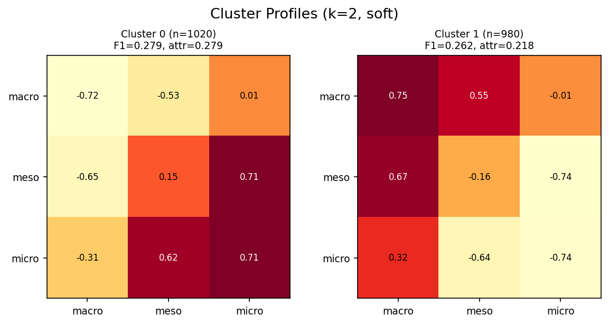
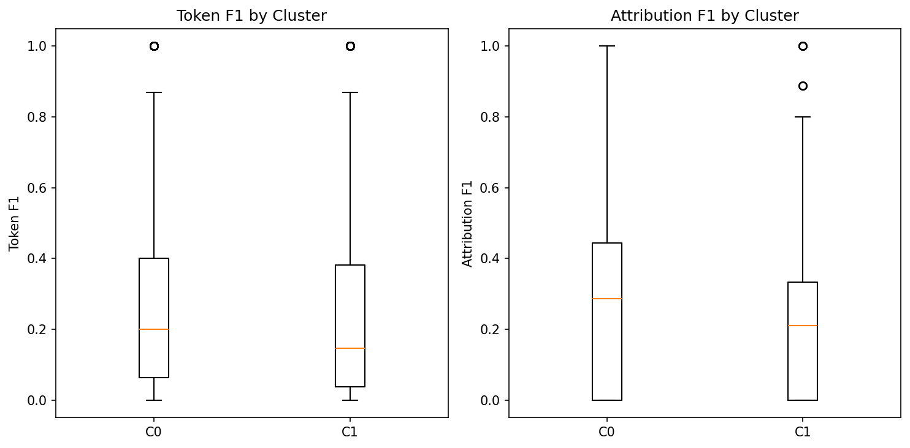
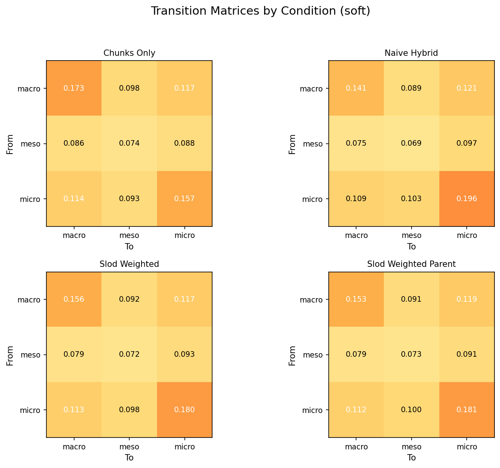
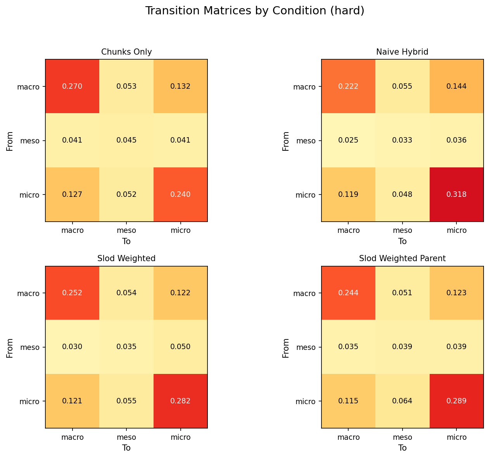
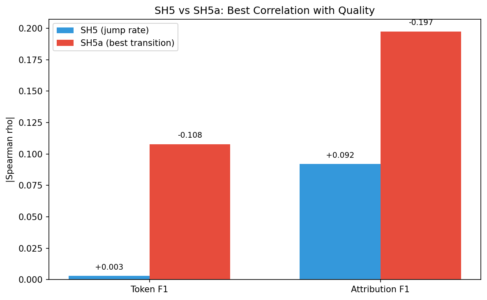
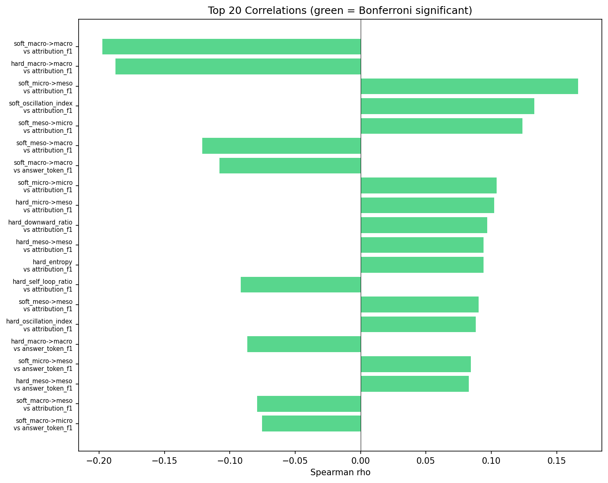

# SH5a Auto-Generated Report: Transition Matrix Analysis

## Executive Summary

**Overall Verdict: CONFIRMED**

- H1 (Transition Signature): PASS
- H2 (Pattern Clusters): PASS
- H3 (Condition Effect): FAIL

## H1: Transition Feature Correlations

Bonferroni-corrected significance threshold: p < 0.000833
Number of comparisons: 60
**Significant features: 20**

### Top 20 Correlations (per-trace, N=2000)

| Feature | Target | rho | p-value | Bonf. p | Sig? |
|---------|--------|-----|---------|---------|------|
| soft_macro->macro | attribution_f1 | -0.1974 | 5.04e-19 | 0.0000 | Yes |
| hard_macro->macro | attribution_f1 | -0.1876 | 2.67e-17 | 0.0000 | Yes |
| soft_micro->meso | attribution_f1 | +0.1665 | 6.68e-14 | 0.0000 | Yes |
| soft_oscillation_index | attribution_f1 | +0.1328 | 2.50e-09 | 0.0000 | Yes |
| soft_meso->micro | attribution_f1 | +0.1237 | 2.82e-08 | 0.0000 | Yes |
| soft_meso->macro | attribution_f1 | -0.1211 | 5.56e-08 | 0.0000 | Yes |
| soft_macro->macro | answer_token_f1 | -0.1079 | 1.33e-06 | 0.0001 | Yes |
| soft_micro->micro | attribution_f1 | +0.1040 | 3.12e-06 | 0.0002 | Yes |
| hard_micro->meso | attribution_f1 | +0.1024 | 4.50e-06 | 0.0003 | Yes |
| hard_downward_ratio | attribution_f1 | +0.0969 | 1.40e-05 | 0.0008 | Yes |
| hard_meso->meso | attribution_f1 | +0.0942 | 2.45e-05 | 0.0015 | Yes |
| hard_entropy | attribution_f1 | +0.0940 | 2.55e-05 | 0.0015 | Yes |
| hard_self_loop_ratio | attribution_f1 | -0.0916 | 4.09e-05 | 0.0025 | Yes |
| soft_meso->meso | attribution_f1 | +0.0902 | 5.36e-05 | 0.0032 | Yes |
| hard_oscillation_index | attribution_f1 | +0.0883 | 7.72e-05 | 0.0046 | Yes |
| hard_macro->macro | answer_token_f1 | -0.0865 | 1.08e-04 | 0.0065 | Yes |
| soft_micro->meso | answer_token_f1 | +0.0845 | 1.56e-04 | 0.0093 | Yes |
| hard_meso->meso | answer_token_f1 | +0.0828 | 2.11e-04 | 0.0127 | Yes |
| soft_macro->meso | attribution_f1 | -0.0792 | 3.92e-04 | 0.0235 | Yes |
| soft_macro->micro | answer_token_f1 | -0.0753 | 7.46e-04 | 0.0448 | Yes |

### Bonferroni-Significant Correlations

| Feature | Target | rho | p-value |
|---------|--------|-----|---------|
| soft_macro->macro | attribution_f1 | -0.1974 | 5.04e-19 |
| hard_macro->macro | attribution_f1 | -0.1876 | 2.67e-17 |
| soft_micro->meso | attribution_f1 | +0.1665 | 6.68e-14 |
| soft_oscillation_index | attribution_f1 | +0.1328 | 2.50e-09 |
| soft_meso->micro | attribution_f1 | +0.1237 | 2.82e-08 |
| soft_meso->macro | attribution_f1 | -0.1211 | 5.56e-08 |
| soft_macro->macro | answer_token_f1 | -0.1079 | 1.33e-06 |
| soft_micro->micro | attribution_f1 | +0.1040 | 3.12e-06 |
| hard_micro->meso | attribution_f1 | +0.1024 | 4.50e-06 |
| hard_downward_ratio | attribution_f1 | +0.0969 | 1.40e-05 |
| hard_meso->meso | attribution_f1 | +0.0942 | 2.45e-05 |
| hard_entropy | attribution_f1 | +0.0940 | 2.55e-05 |
| hard_self_loop_ratio | attribution_f1 | -0.0916 | 4.09e-05 |
| soft_meso->meso | attribution_f1 | +0.0902 | 5.36e-05 |
| hard_oscillation_index | attribution_f1 | +0.0883 | 7.72e-05 |
| hard_macro->macro | answer_token_f1 | -0.0865 | 1.08e-04 |
| soft_micro->meso | answer_token_f1 | +0.0845 | 1.56e-04 |
| hard_meso->meso | answer_token_f1 | +0.0828 | 2.11e-04 |
| soft_macro->meso | attribution_f1 | -0.0792 | 3.92e-04 |
| soft_macro->micro | answer_token_f1 | -0.0753 | 7.46e-04 |

## H2: Clustering Analysis

Best k: 2 (silhouette: 0.2930)
ANOVA on token-F1: p = 1.7630e-01
ANOVA on attribution-F1: p = 1.9172e-08

### Cluster Profiles

| Cluster | Size | Mean Token-F1 | Mean Attribution-F1 |
|---------|------|---------------|---------------------|
| 0 | 1020 | 0.2793 | 0.2794 |
| 1 | 980 | 0.2616 | 0.2180 |

## H3: Condition Comparison

Chi-squared (4 conditions): chi2 = 10.95, p = 9.8936e-01
Chi-squared (routed vs unrouted): p = 9.9999e-01

## Logistic Regression

**Token-F1**: CV accuracy = 0.5550 (+/- 0.0105), AUC = 0.5739 (+/- 0.0078)

Top features for Token-F1:

| Feature | Coefficient |
|---------|-------------|
| soft_meso->meso | +0.4880 |
| hard_oscillation_index | -0.4810 |
| soft_macro->meso | -0.2958 |
| hard_upward_ratio | +0.2315 |
| soft_meso->macro | +0.1729 |

**Attribution-F1**: CV accuracy = 0.6195 (+/- 0.0176), AUC = 0.6030 (+/- 0.0218)

Top features for Attribution-F1:

| Feature | Coefficient |
|---------|-------------|
| hard_upward_ratio | -0.3299 |
| soft_micro->meso | +0.3251 |
| hard_downward_ratio | -0.3193 |
| hard_entropy | +0.2586 |
| soft_entropy | -0.2432 |

## Comparison with SH5

| Metric | SH5 (jump rate) | SH5a (best transition) |
|--------|-----------------|------------------------|
| Token-F1 rho | +0.003 | -0.107856 |
| Attribution-F1 rho | +0.092 | -0.197423 |

