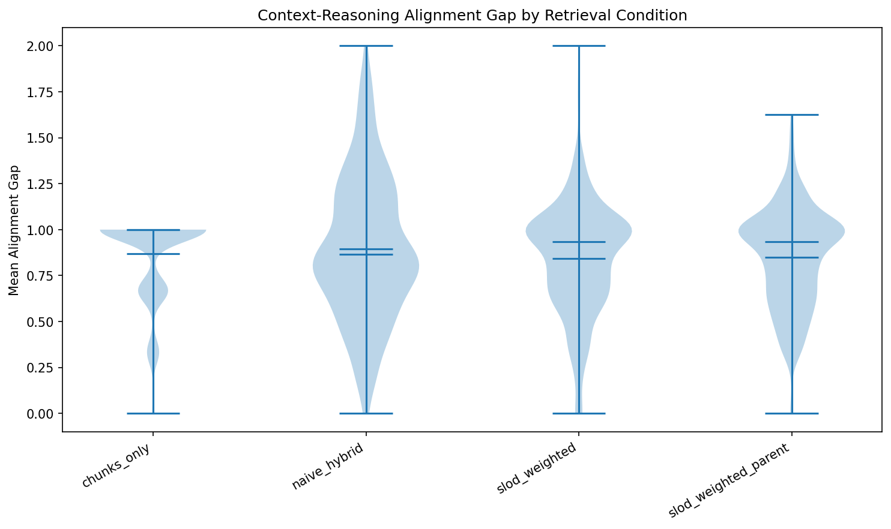
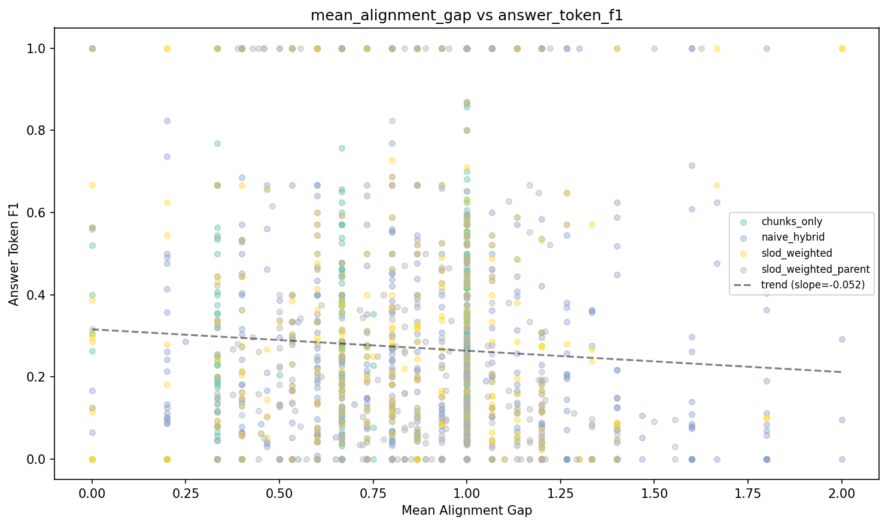
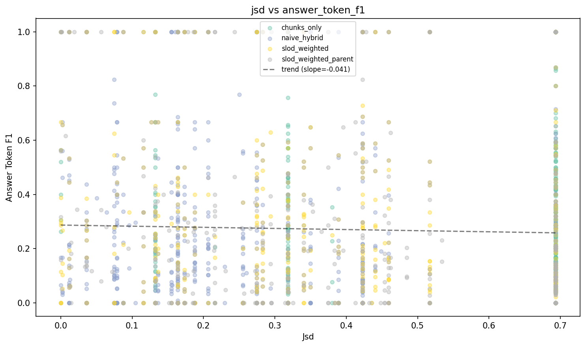
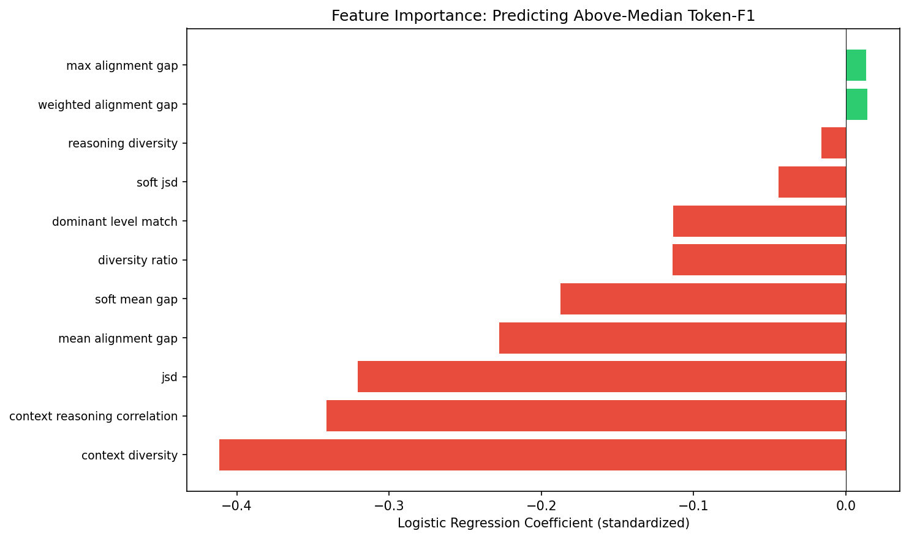
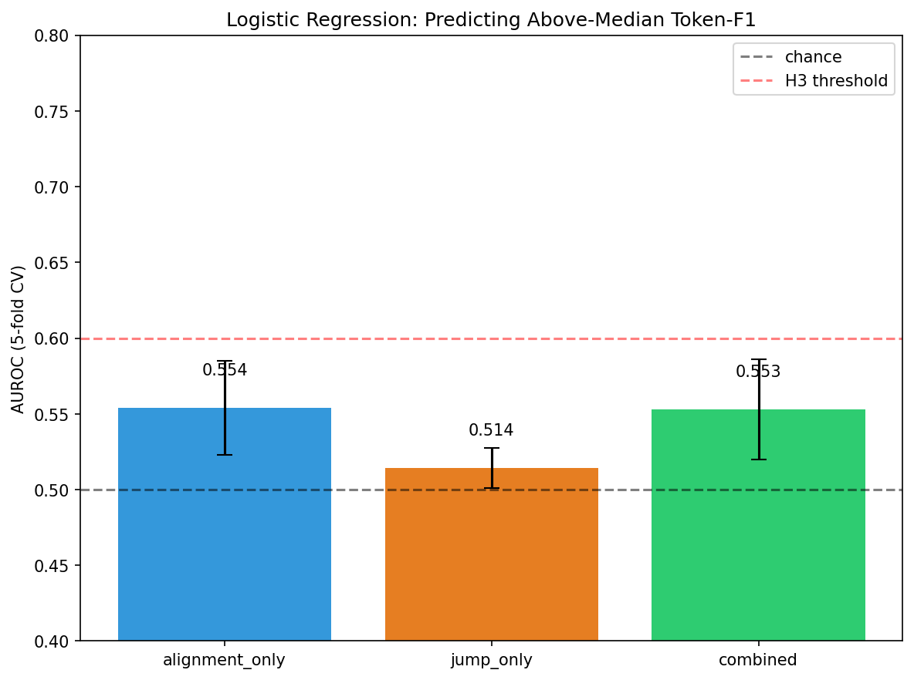

# SH5c Auto-Report: Per-Question SLoD Consistency Predicts Quality

## Verdict: **CONFIRMED**

## H1: Alignment-Quality Correlation
**Status: CONFIRMED**

- mean_alignment_gap vs attribution_f1: rho=-0.1340, p_corr=0.0000
- jsd vs attribution_f1: rho=-0.1300, p_corr=0.0000
- context_reasoning_correlation vs attribution_f1: rho=+0.1046, p_corr=0.0001
- weighted_alignment_gap vs attribution_f1: rho=-0.1354, p_corr=0.0000
- soft_mean_gap vs attribution_f1: rho=-0.1079, p_corr=0.0000

### Full Correlation Table (Pooled, N=2000)
| Feature | vs token-F1 (rho) | p_corr | vs attr-F1 (rho) | p_corr |
|---------|-------------------|--------|-------------------|--------|
| context_diversity | -0.0368 | 1.0000 | +0.0290 | 1.0000 |
| context_reasoning_correlation | +0.0340 | 1.0000 | +0.1046 * | 0.0001 |
| diversity_ratio | +0.0327 | 1.0000 | +0.0144 | 1.0000 |
| dominant_level_match | +0.0217 | 1.0000 | +0.0822 * | 0.0051 |
| jsd | -0.0361 | 1.0000 | -0.1300 * | 0.0000 |
| max_alignment_gap | -0.0863 * | 0.0024 | -0.0516 | 0.4624 |
| mean_alignment_gap | -0.0736 * | 0.0218 | -0.1340 * | 0.0000 |
| reasoning_diversity | +0.0064 | 1.0000 | +0.0763 * | 0.0140 |
| soft_jsd | -0.0130 | 1.0000 | -0.0981 * | 0.0002 |
| soft_mean_gap | -0.0140 | 1.0000 | -0.1079 * | 0.0000 |
| weighted_alignment_gap | -0.0727 * | 0.0252 | -0.1354 * | 0.0000 |

## H2: Cross-Condition Alignment
**Status: CONFIRMED**

- slod_weighted_vs_chunks_only / jsd: p=0.0000, routed=0.3746, baseline=0.5637
- slod_weighted_vs_chunks_only / weighted_alignment_gap: p=0.0268, routed=0.8454, baseline=0.8745
- slod_weighted_vs_chunks_only / soft_jsd: p=0.0000, routed=0.2310, baseline=0.3879
- slod_weighted_vs_naive_hybrid / mean_alignment_gap: p=0.0130, routed=0.8433, baseline=0.8942
- slod_weighted_vs_naive_hybrid / weighted_alignment_gap: p=0.0318, routed=0.8454, baseline=0.8914
- slod_weighted_parent_vs_chunks_only / jsd: p=0.0000, routed=0.3828, baseline=0.5637
- slod_weighted_parent_vs_chunks_only / weighted_alignment_gap: p=0.0450, routed=0.8524, baseline=0.8745
- slod_weighted_parent_vs_chunks_only / soft_jsd: p=0.0000, routed=0.2254, baseline=0.3879

## H3: Predictive Power
**Status: NOT CONFIRMED**

- Alignment-only AUROC: 0.5538 +/- 0.0310

### Model Comparison
| Model | AUROC | Std | N | Features |
|-------|-------|-----|---|----------|
| alignment_only | 0.5538 | 0.0310 | 1852 | 11 |
| jump_only | 0.5141 | 0.0132 | 2000 | 5 |
| combined | 0.5528 | 0.0332 | 1852 | 16 |

## Subgroup Analysis
### By Condition
| Condition | Mean Align Gap | Mean JSD | Mean Token-F1 |
|-----------|---------------|----------|---------------|
| chunks_only | 0.8676 | 0.5637 | 0.2773 |
| naive_hybrid | 0.8942 | 0.2435 | 0.2591 |
| slod_weighted | 0.8433 | 0.3746 | 0.2712 |
| slod_weighted_parent | 0.8500 | 0.3828 | 0.2750 |

## Figures

