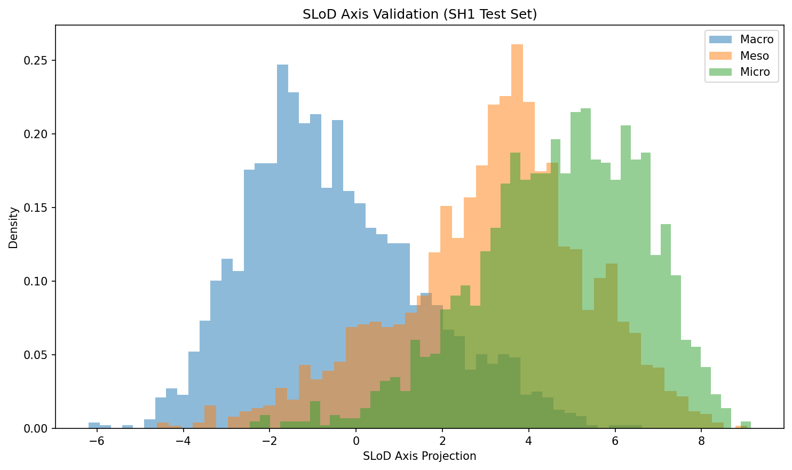
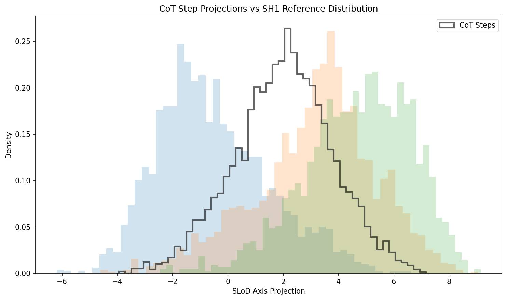
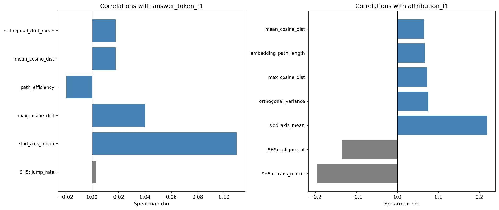
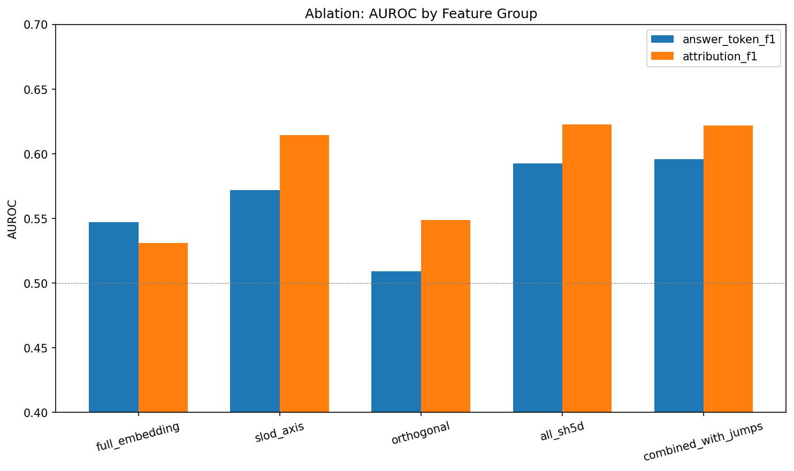
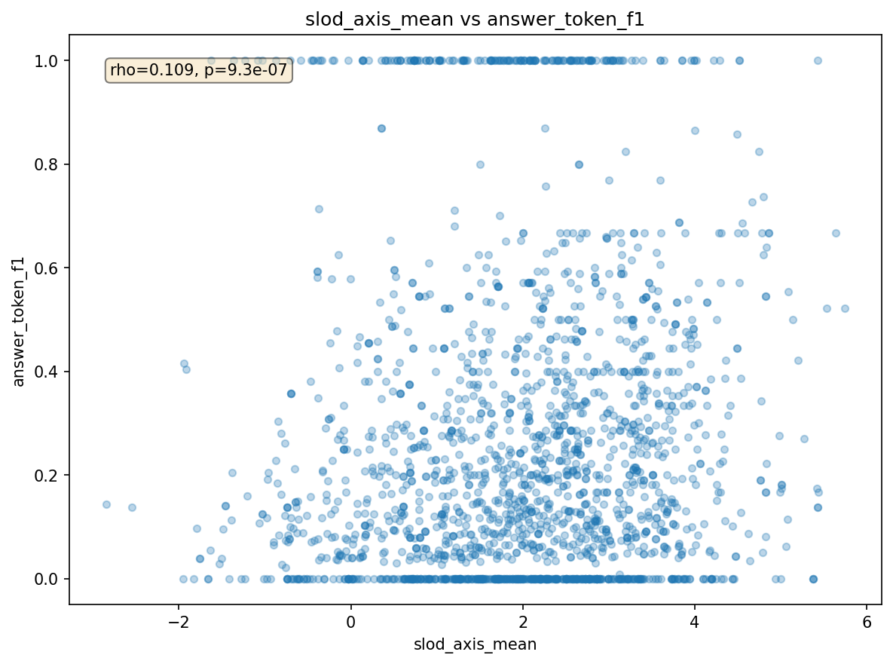
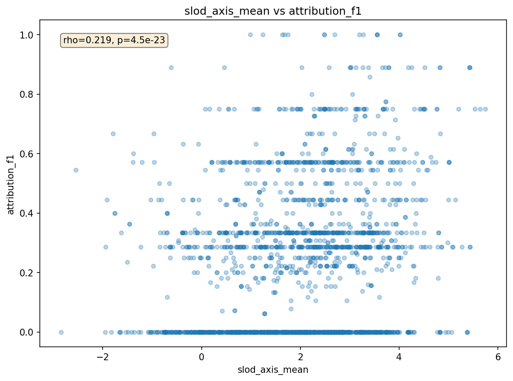

# SH5d Results: Probe-Free Embedding Distance

**Traces analyzed:** 2000
**Significant correlations (Bonferroni):** 4 / 30

## Correlation Table

| Feature | Metric | Spearman rho | p (corrected) | Sig? |
|---------|--------|-------------|---------------|------|
| slod_axis_mean | attribution_f1 | +0.2187 | 1.3496e-21 | YES |
| slod_axis_mean | answer_token_f1 | +0.1094 | 2.7938e-05 | YES |
| orthogonal_variance | attribution_f1 | +0.0753 | 2.2390e-02 | YES |
| max_cosine_dist | attribution_f1 | +0.0725 | 3.5108e-02 | YES |
| embedding_path_length | attribution_f1 | +0.0672 | 7.8909e-02 |  |
| mean_cosine_dist | attribution_f1 | +0.0645 | 1.1772e-01 |  |
| orthogonal_drift_mean | attribution_f1 | +0.0621 | 1.6469e-01 |  |
| slod_axis_variance | attribution_f1 | +0.0137 | 1.0000e+00 |  |
| slod_axis_variance | answer_token_f1 | +0.0050 | 1.0000e+00 |  |
| path_efficiency | attribution_f1 | -0.0107 | 1.0000e+00 |  |
| path_efficiency | answer_token_f1 | -0.0196 | 1.0000e+00 |  |
| embedding_path_length | answer_token_f1 | +0.0105 | 1.0000e+00 |  |
| embedding_displacement | answer_token_f1 | -0.0095 | 1.0000e+00 |  |
| slod_ratio | answer_token_f1 | +0.0095 | 1.0000e+00 |  |
| max_cosine_dist | answer_token_f1 | +0.0401 | 1.0000e+00 |  |
| embedding_displacement | attribution_f1 | +0.0426 | 1.0000e+00 |  |
| slod_axis_range | attribution_f1 | +0.0122 | 1.0000e+00 |  |
| orthogonal_variance | answer_token_f1 | +0.0148 | 1.0000e+00 |  |
| slod_axis_drift_mean | attribution_f1 | +0.0275 | 1.0000e+00 |  |
| slod_axis_monotonicity | answer_token_f1 | +0.0135 | 1.0000e+00 |  |
| slod_axis_drift_mean | answer_token_f1 | +0.0120 | 1.0000e+00 |  |
| orthogonal_drift_mean | answer_token_f1 | +0.0177 | 1.0000e+00 |  |
| slod_axis_drift_max | answer_token_f1 | +0.0056 | 1.0000e+00 |  |
| slod_axis_monotonicity | attribution_f1 | +0.0347 | 1.0000e+00 |  |
| slod_axis_direction | attribution_f1 | +0.0418 | 1.0000e+00 |  |
| slod_axis_direction | answer_token_f1 | +0.0039 | 1.0000e+00 |  |
| slod_axis_drift_max | attribution_f1 | +0.0243 | 1.0000e+00 |  |
| mean_cosine_dist | answer_token_f1 | +0.0177 | 1.0000e+00 |  |
| slod_axis_range | answer_token_f1 | +0.0029 | 1.0000e+00 |  |
| slod_ratio | attribution_f1 | +0.0106 | 1.0000e+00 |  |

## Ablation: AUROC by Feature Group

| Group | token-F1 AUROC | attr-F1 AUROC |
|-------|---------------|---------------|
| full_embedding | 0.5469 | 0.5310 |
| slod_axis | 0.5718 | 0.6145 |
| orthogonal | 0.5090 | 0.5489 |
| all_sh5d | 0.5924 | 0.6227 |
| combined_with_jumps | 0.5958 | 0.6220 |

## Baseline Comparison

| Method | Best rho (attr-F1) | Best rho (token-F1) |
|--------|-------------------|---------------------|
| SH5 (jump rate) | — | 0.003 |
| SH5a (transition matrix) | -0.197 | — |
| SH5c (alignment) | -0.135 | — |
| SH5d (this work) | 0.21865200912855795 | 0.10943213630548947 |

## Figures

