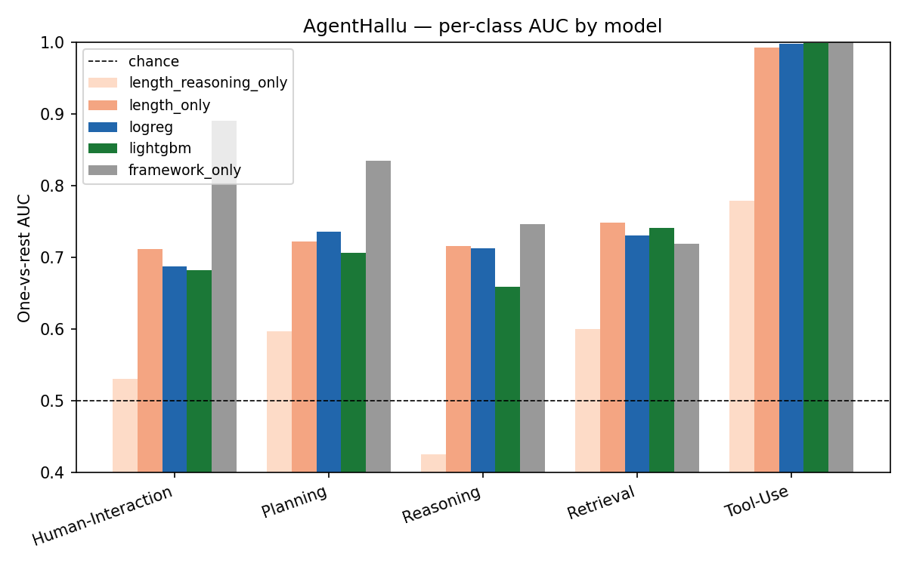
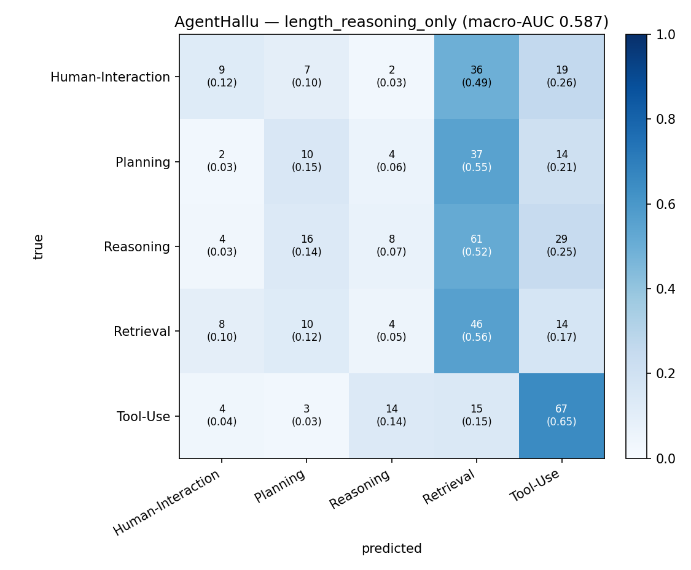
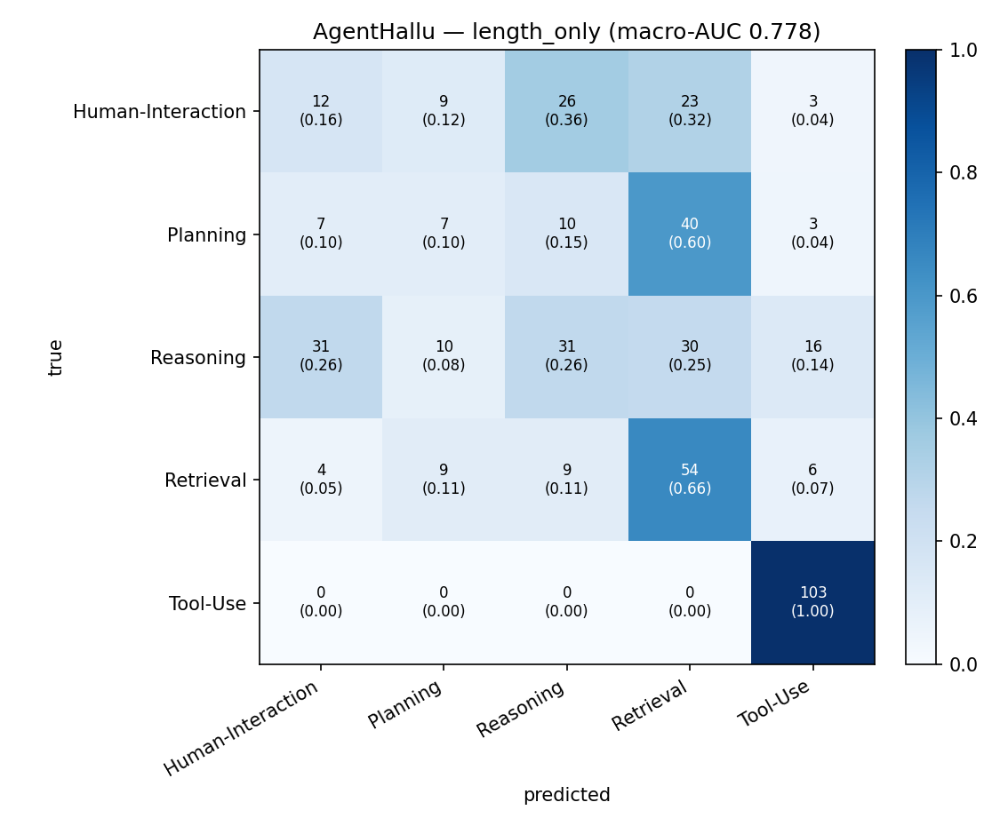
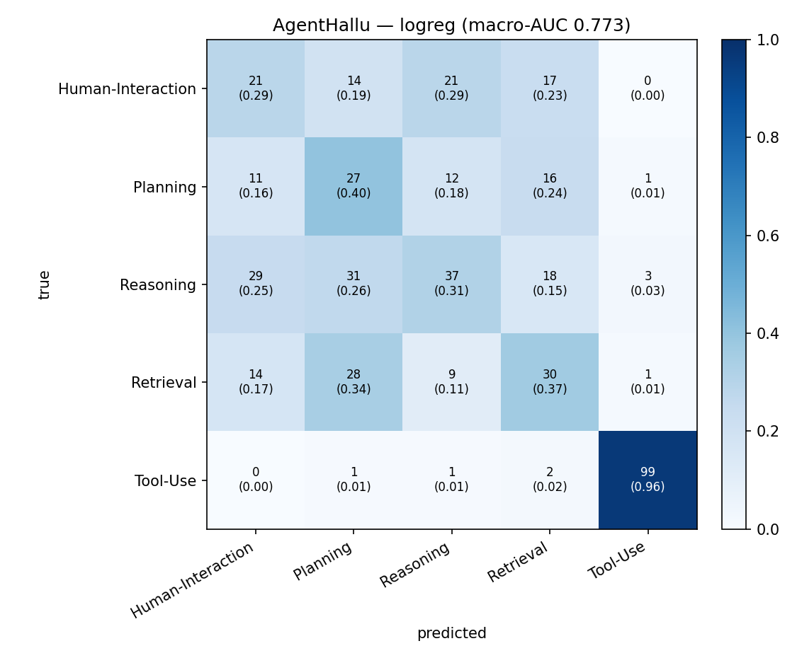
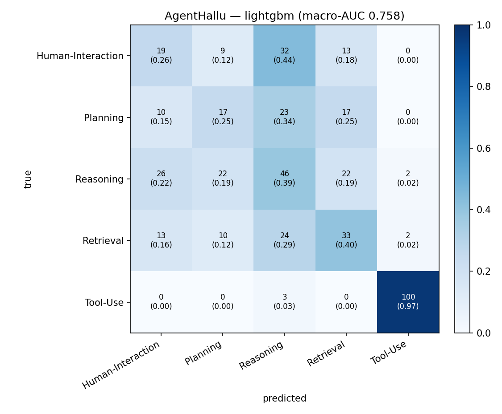
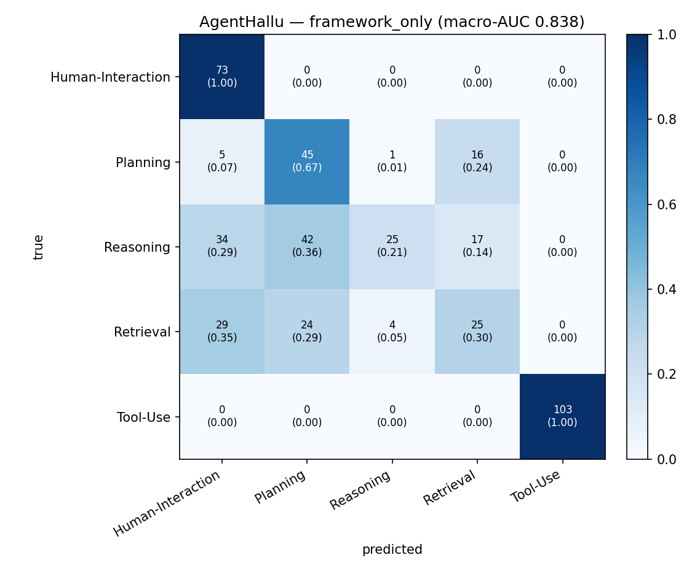

# SH6 Stage-5g — AgentHallu Hallucination-Category Classification (Full Set)

**Subset:** all hallucinated AgentHallu items (443; correct items excluded)
**Classes (5):** `Human-Interaction Hallucination` (n=73), `Planning Hallucination` (n=67), `Reasoning Hallucination` (n=118), `Retrieval Hallucination` (n=82), `Tool-Use Hallucination` (n=103)
**Feature set:** `trajectory_full` (63 cols)
**CV:** 5-fold stratified, random_state=42
**Chance baseline (macro one-vs-rest AUC):** 0.500

## Class × framework cross-tab (leakage source)

| framework      |   Human-Interaction Hallucination |   Planning Hallucination |   Reasoning Hallucination |   Retrieval Hallucination |   Tool-Use Hallucination |
|:---------------|----------------------------------:|-------------------------:|--------------------------:|--------------------------:|-------------------------:|
| BFCL           |                                 0 |                        0 |                         0 |                         0 |                      103 |
| Camel          |                                31 |                        5 |                        14 |                         7 |                        0 |
| Magentic_One   |                                 0 |                       20 |                        26 |                         8 |                        0 |
| Octotools      |                                 0 |                        1 |                        25 |                         4 |                        0 |
| OpenDeepSearch |                                 0 |                       16 |                        17 |                        25 |                        0 |
| OpenManus      |                                42 |                        0 |                        20 |                        22 |                        0 |
| SmolAgents     |                                 0 |                       25 |                        16 |                        16 |                        0 |

## Summary

| Model | Macro AUC (OvR) | Bal. Acc | Acc |
|---|---:|---:|---:|
| `length_reasoning_only` | 0.587 | 0.310 | 0.316 |
| `length_only` | 0.778 | 0.438 | 0.467 |
| `logreg` | 0.773 | 0.466 | 0.483 |
| `lightgbm` | 0.758 | 0.455 | 0.485 |
| `framework_only` | 0.838 | 0.638 | 0.612 |

## Per-class AUC (one-vs-rest)

| Class | length_reasoning_only | length_only | logreg | lightgbm | framework_only |
|---|---:|---:|---:|---:|---:|
| `Human-Interaction Hallucination` | 0.531 | 0.711 | 0.687 | 0.682 | 0.890 |
| `Planning Hallucination` | 0.598 | 0.723 | 0.736 | 0.706 | 0.835 |
| `Reasoning Hallucination` | 0.426 | 0.716 | 0.712 | 0.660 | 0.746 |
| `Retrieval Hallucination` | 0.600 | 0.749 | 0.731 | 0.742 | 0.719 |
| `Tool-Use Hallucination` | 0.779 | 0.992 | 0.998 | 0.999 | 1.000 |

## Δ macro-AUC (paired bootstrap, 95% CI)

| Comparison | Δ mean | CI low | CI high | Verdict |
|---|---:|---:|---:|:---|
| lightgbm − logreg | -0.015 | -0.035 | +0.005 | inconclusive (CI straddles 0) |
| logreg − length_reasoning_only (shape lift, clean) | +0.185 | +0.147 | +0.221 | significant lift |
| lightgbm − length_reasoning_only (shape lift, clean) | +0.171 | +0.133 | +0.207 | significant lift |
| length_only − length_reasoning_only (framework leak in length baseline) | +0.192 | +0.160 | +0.223 | significant lift |
| lightgbm − framework_only | -0.081 | -0.108 | -0.053 | significant regression |
| logreg − framework_only | -0.066 | -0.095 | -0.036 | significant regression |

## Plots

