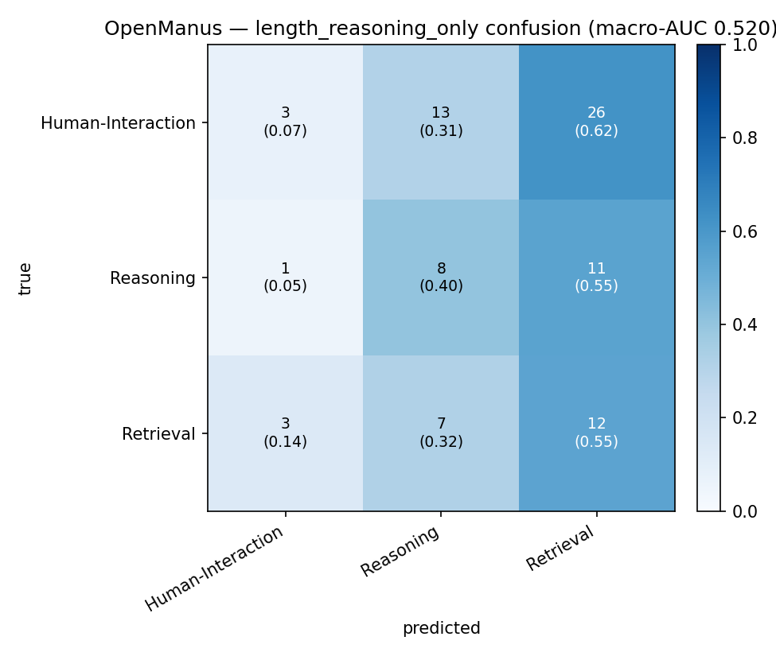
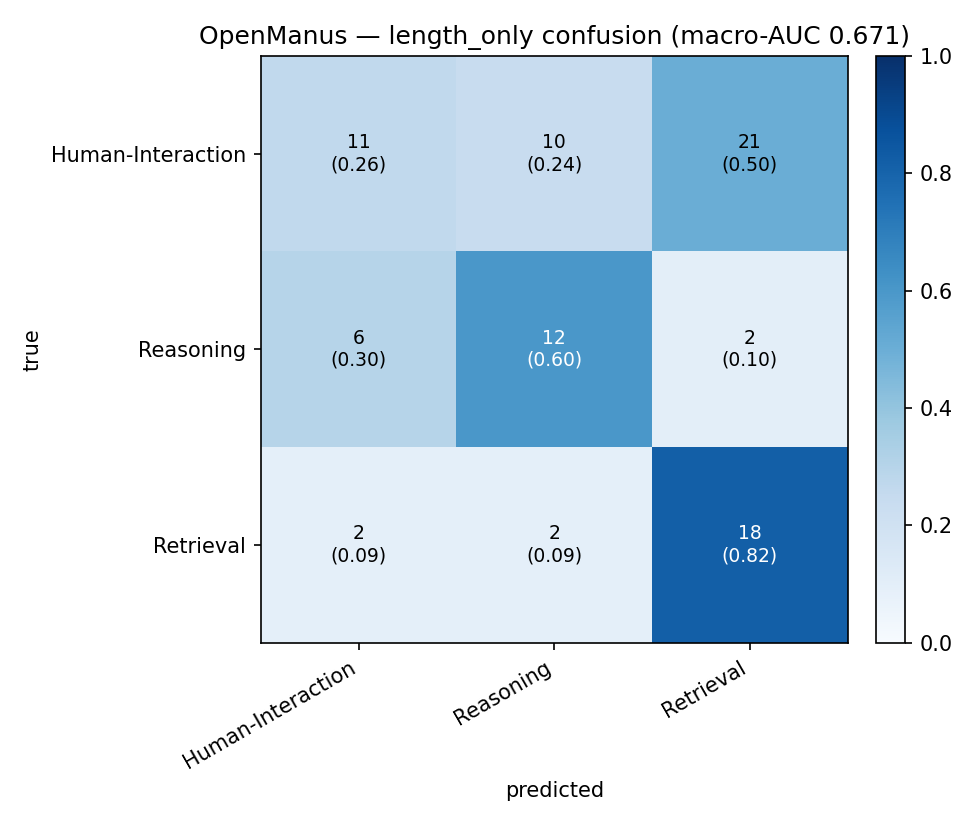

# SH6 Stage-5f — OpenManus Hallucination-Category Classification

**Subset:** OpenManus failures only (84 items)
**Classes:** `Human-Interaction Hallucination` (n=42), `Reasoning Hallucination` (n=20), `Retrieval Hallucination` (n=22)
**Feature set:** `trajectory_full` (63 cols)
**CV:** 5-fold stratified, random_state=42
**Chance baseline (macro one-vs-rest AUC):** 0.500

## Summary

| Model | Macro AUC (OvR) | Bal. Acc | Acc |
|---|---:|---:|---:|
| `length_reasoning_only` | 0.520 | 0.339 | 0.274 |
| `length_only` | 0.671 | 0.560 | 0.488 |
| `logreg` | 0.682 | 0.458 | 0.452 |
| `lightgbm` | 0.712 | 0.516 | 0.524 |

## Per-class AUC (one-vs-rest)

| Class | length_reasoning_only | length_only | logreg | lightgbm |
|---|---:|---:|---:|---:|
| `Human-Interaction Hallucination` | 0.395 | 0.484 | 0.559 | 0.575 |
| `Reasoning Hallucination` | 0.670 | 0.794 | 0.690 | 0.771 |
| `Retrieval Hallucination` | 0.496 | 0.734 | 0.796 | 0.790 |

## Δ macro-AUC (paired bootstrap, 95% CI)

| Comparison | Δ mean | CI low | CI high | Verdict |
|---|---:|---:|---:|:---|
| lightgbm − logreg | +0.031 | -0.044 | +0.113 | inconclusive (CI straddles 0) |
| logreg − length_reasoning_only (shape lift, clean) | +0.161 | +0.051 | +0.266 | significant lift |
| lightgbm − length_reasoning_only (shape lift, clean) | +0.194 | +0.081 | +0.299 | significant lift |
| lightgbm − length_only (shape lift over all chunk counts) | +0.041 | -0.055 | +0.142 | inconclusive (CI straddles 0) |

## Confusion matrices

## UMAP

