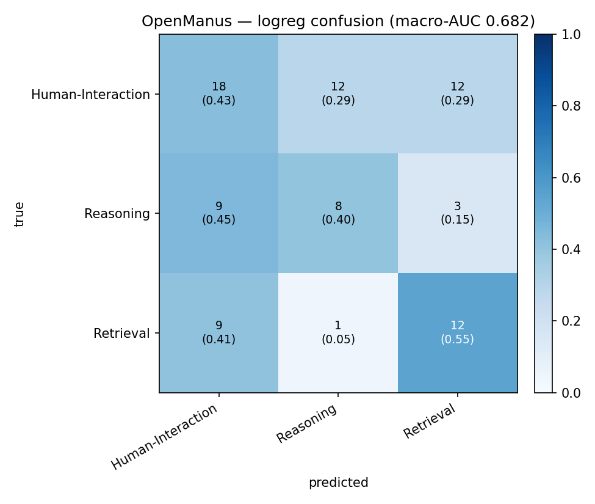
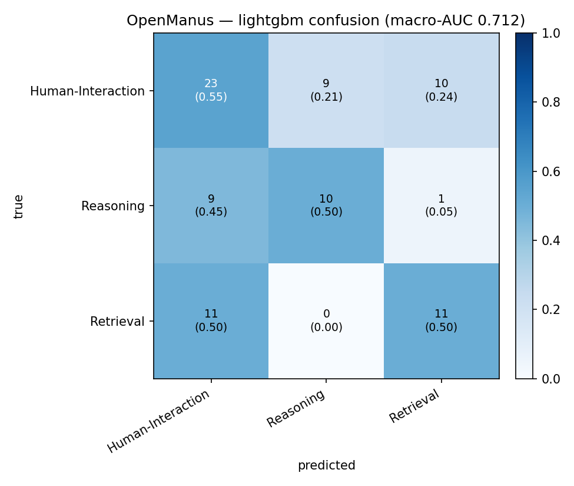
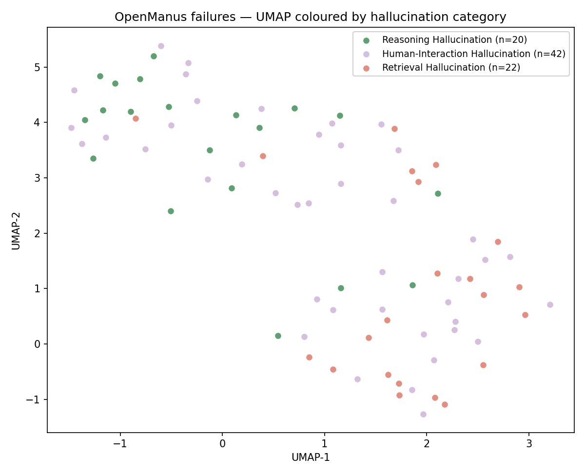

# SH6 Stage-5f — OpenManus Hallucination-Category Classification

**Subset:** OpenManus failures only (84 items)
**Classes:** `Human-Interaction Hallucination` (n=42), `Reasoning Hallucination` (n=20), `Retrieval Hallucination` (n=22)
**Feature set:** `trajectory_full` (63 cols)
**CV:** 5-fold stratified, random_state=42
**Chance baseline (macro one-vs-rest AUC):** 0.500

## Summary

| Model | Macro AUC (OvR) | Bal. Acc | Acc |
|---|---:|---:|---:|
| `logreg` | 0.682 | 0.458 | 0.452 |
| `lightgbm` | 0.712 | 0.516 | 0.524 |

## Per-class AUC (one-vs-rest)

| Class | logreg | lightgbm |
|---|---:|---:|
| `Human-Interaction Hallucination` | 0.559 | 0.575 |
| `Reasoning Hallucination` | 0.690 | 0.771 |
| `Retrieval Hallucination` | 0.796 | 0.790 |

## Δ macro-AUC (lightgbm − logreg)

- Bootstrap mean: **+0.031**
- 95% paired-bootstrap CI: **[-0.044, +0.113]** (CI includes 0 → inconclusive)

## Confusion matrices

## UMAP

