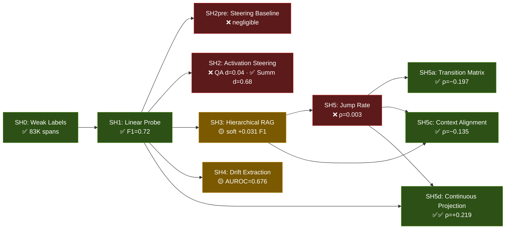

# SemanticScale Research Map

## 1. Overview

### 1.1 Research Thesis

Frozen LLM representations encode a continuous **Semantic Level of Detail (SLoD)** axis — a geometric structure where text at different abstraction levels (macro: high-level concepts, meso: section-level descriptions, micro: specific entities/methods/values) occupies distinct regions of embedding space. This axis is **linearly decodable** without retraining (SH1), **steerable** via activation injection when task-domain alignment is maintained (SH2), **useful** for retrieval routing (SH3) and extraction quality prediction (SH4), and **observable** as a behavioral signature in reasoning traces (SH5d). The project builds a five-layer proof across 10 experiments.

### 1.2 Repository Structure

```
SemanticScale/
├── experiments/               # 10 self-contained experiments (SH0–SH5d)
│   ├── sh0_weak_labels/       # Foundation: heuristic SLoD labeling
│   ├── sh1_linear_probe/      # Detection: linear decodability proof
│   ├── sh2_activation_steering/  # Control: generation steering
│   ├── sh2pre_baseline_steering/ # Control: preliminary steering
│   ├── sh3_hierarchical_rag/  # Application: SLoD-routed retrieval
│   ├── sh4_drift_extraction/  # Application: extraction quality prediction
│   ├── sh5_jump_rate/         # Behavioral: scalar jump rate (null)
│   ├── sh5a_transition_matrix/   # Behavioral: transition decomposition
│   ├── sh5c_context_alignment/   # Behavioral: context-reasoning alignment
│   └── sh5d_continuous_projection/ # Behavioral: continuous SLoD projection
├── docs/                      # Narrative, roadmap, data dictionary, reproduction
├── data/                      # Downloaded datasets (~3.4 GB, gitignored)
├── setup_data.py              # HuggingFace data downloader
└── requirements.txt
```

**Key conventions:** Each experiment is fully self-contained with `config.yaml`, `DESIGN.md`, `README.md`, numbered `scripts/` (01–07), `src/` modules, and `reports/` output. No cross-imports between experiments. Data paths reference `../../data/sh{N}` via config. Reports are generated artifacts — regenerate, don't hand-edit.

**Repository:** [github.com/omniscale-ai/SemanticScale](https://github.com/omniscale-ai/SemanticScale) · Apache 2.0

### 1.3 Experiment Dependency Graph



**Status key:** ✅ Confirmed · 🟡 Partial · ❌ Not confirmed · ✅✅ Strong

| # | Experiment | Hypothesis | Verdict | Key Result |
|---|---|---|---|---|
| SH0 | Weak Label Bootstrap | Document structure provides SLoD labels | ✅ | 83K spans, 84.9% agreement |
| SH1 | Linear Probe | SLoD linearly decodable from frozen embeddings | ✅ | SciBERT macro-F1 = 0.72 |
| SH2 | Activation Steering | Steering shifts SLoD in generation | ❌ QA / ✅ Summ | QA d=0.043; Summ d=0.679 |
| SH2pre | Baseline Steering | Preliminary steering validation | ❌ | Same as SH2 |
| SH3 | Hierarchical RAG | SLoD routing improves retrieval | 🟡 | Soft routing +0.031 F1 (p<0.001) |
| SH4 | Drift Extraction | Drift predicts extraction quality | 🟡 | Combined AUROC=0.676; drift-only ≈ random |
| SH5 | Jump Rate | Jump rate correlates with quality | ❌ | ρ=0.003, p=0.90 (null) |
| SH5a | Transition Matrix | Transition patterns predict quality | ✅ | macro→macro ρ=−0.197; 2 reasoning styles |
| SH5c | Context Alignment | Context-reasoning alignment matters | ✅ | Alignment gap ρ=−0.135 |
| SH5d | Continuous Projection | Continuous SLoD projection beats discrete | ✅✅ | ρ=+0.219 (3× > orthogonal control) |

## 2. Data Management

### 2.1 Data Setup

All experiment data (~3.4 GB) is hosted on [HuggingFace](https://huggingface.co/datasets/anaderi/semantic-scale-data) and downloaded to `data/` at the repo root.

```bash
pip install -r requirements.txt
python setup_data.py                          # all experiments
python setup_data.py --experiments sh0 sh1    # selective
```

Set `SLOD_DATA_ROOT` to override the default data location. Experiments reference data via `../../data/sh{N}` in their `config.yaml`.

### 2.2 Data Dictionary

| Dataset | Size | Key Files | Format |
|---|---|---|---|
| SH0 | 155 MB | `qasper_slod_spans.jsonl`, `qasper_slod_length_matched.jsonl` | JSONL |
| SH1 | 315 MB | `embeddings/` (SciBERT, MiniLM, Specter2), `splits.json` | NPZ, JSON |
| SH2 | 172 MB | `steering_vectors.npz`, `*_answers.jsonl`, `summarization/` | NPZ, JSONL |
| SH3 | 2.1 GB | `embeddings/`, `results/` (13 conditions), `papers_index.jsonl` | NPZ, JSONL |
| SH4 | 390 MB | `raw/`, `extractions/`, `features/`, `models/` | JSONL, PKL |
| SH5 | 16 MB | `cot_traces/`, `cot_slod_tags.jsonl`, `answer_scores.jsonl` | JSONL |
| SH5a | ~5 MB | Transition matrices, clustering results | JSON, NPZ |
| SH5c | ~10 MB | Alignment features, subgroup analysis | JSON, CSV |
| SH5d | ~10 MB | Embedding features, SLoD axis projections | NPZ, JSON |

Source dataset: [allenai/qasper](https://huggingface.co/datasets/allenai/qasper) (1,585 NLP papers).

## 3. Mechanistic Layer: SLoD Labeling and Probing (SH0 & SH1)

These two experiments establish the foundation: that SLoD exists as a reliable, detectable geometric property of frozen embeddings.

### 3.1 SH0 — Weak Label Bootstrap

**Hypothesis:** Heuristically labeled datasets of document text spans can classify semantic levels of detail (macro/meso/micro) using document structure signals with high inter-annotator agreement.

**Method:** Built a heuristic labeling pipeline using section-name regex matching, document position rules, and content scoring (word count, entity density, citations, numeric density). Applied to QASPER dataset (1,585 NLP papers). Created a length-matched subset eliminating the length confound between abstraction levels. Validated with 6 automated sanity checks and manual spot-checking.

**Key Results:**
- 83,135 labeled spans across 50 papers
- Length-matched subset: 37,278 spans (12,426 per class)
- 84.9% human agreement with heuristic labels
- Verdict: ✅ **CONFIRMED**

**What This Means:** This experiment is the bedrock — every downstream experiment depends on these labels. The heuristic approach was deliberately simple (regex + position + content scoring) to ensure labels reflect document structure rather than circular model artifacts. The 84.9% agreement rate validates that macro/meso/micro is a real, human-recognizable distinction in scientific text, not a statistical ghost. The length-matched subset was critical for SH1 — without it, a probe could cheat by learning text length rather than abstraction level.

**Files:** `experiments/sh0_weak_labels/` · `src/heuristic_labeler.py` · `src/length_matcher.py`

### 3.2 SH1 — Linear Probe on Frozen Embeddings

**Hypothesis:** Semantic Level of Detail (macro/meso/micro) is linearly decodable from frozen transformer embeddings using logistic regression and linear SVM probes.

**Method:** Embedded 37,278 SH0 length-matched spans using three models (SciBERT, Specter2, MiniLM). Trained linear probes (LogReg, SVM) on 3-way classification with stratified paper-grouped splits (no paper leakage between train and test). Visualized cluster separation with t-SNE and PCA.

**Key Results:**
- SciBERT LogReg macro-F1 = 0.72 on 3-way classification
- Cohen's d = 2.65 (macro vs micro centroid separation on SLoD axis)
- Clear cluster separation in t-SNE/PCA visualizations
- Meso is hardest to classify — genuinely ambiguous middle level
- Verdict: ✅ **CONFIRMED**

**What This Means:** This is the central mechanistic claim — SLoD is not just a labeling convention but a geometric reality in embedding space. The linear decodability (no hidden layers needed) means the structure is a first-order property of the representation, not a nonlinear artifact. The massive Cohen's d = 2.65 between macro and micro centroids defines the "SLoD axis" used by every subsequent experiment. Specter2 surprisingly underperformed MiniLM, suggesting domain-specific embeddings aren't always better for granularity tasks.

**Files:** `experiments/sh1_linear_probe/` · `src/embed_spans.py` · `src/train_probe.py` · `src/analyze.py`

## 4. Control Layer: Activation Steering (SH2pre & SH2)

Can the SLoD axis be used to actively control generation? These experiments test whether injecting steering vectors into a generative model shifts output abstraction level.

### 4.1 SH2pre — Baseline Steering Prototype

**Hypothesis:** Activation steering via residual stream injection of SLoD-derived steering vectors can shift generated answer abstraction.

**Method:** Preliminary exploration computing steering vectors from macro/micro span centroids in Mistral-7B hidden states. Tested different layer and alpha parameters. Evaluated shift via external SciBERT probe.

**Key Results:**
- Negligible steering effect across all tested configurations
- Served as exploration for the full SH2 experiment
- Verdict: ❌ **NOT CONFIRMED**

**What This Means:** This was the initial reconnaissance that revealed the difficulty of the steering problem. The null result here motivated the more systematic SH2 investigation with multiple strategies and the eventual pivot to summarization.

**Files:** `experiments/sh2pre_baseline_steering/`

### 4.2 SH2 — Full Activation Steering Experiment

**Hypothesis:** Activation steering in a generative LLM can controllably shift the semantic level of detail of generated scientific text while preserving factual accuracy.

**Method:** Computed SLoD axis from SH1 embeddings. Computed steering vectors in Mistral-7B's residual stream across all layers. Applied steering with varying alpha values during generation on 500 QASPER questions. Evaluated via SciBERT projection (SLoD shift), surface metrics (entity/citation/numeric density), and token-F1 (factuality). After QA failure, pivoted to summarization task.

**Key Results:**

*QA steering (5 experiments, all failed):*
- Micro-direction steering: Cohen's d = 0.043 (required ≥ 0.5)
- Layer selection bug discovered: `max(abs(shift))` chose anti-correlated layer instead of `max(shift)` for correct direction
- Prompt control ceiling: d = 0.121 (SciBERT SLoD axis can't discriminate QA answers)

*Summarization steering (breakthrough):*
- Cohen's d = 0.679 (above 0.5 threshold)
- ROUGE-L improves — steered summaries are factually better, not just shifted
- All three hypotheses pass: shift confirmed, surface metrics change, quality preserved

- Verdict: ❌ QA **NOT CONFIRMED** · ✅ Summarization **CONFIRMED**

**What This Means:** This is the project's most instructive experiment — five failures followed by a breakthrough that reframed them all. The QA failures weren't method failures but **measurement failures**: the SciBERT SLoD axis was trained on document spans and simply cannot discriminate QA-genre text. Summaries are document-like text, so the evaluation axis works. This yielded the project's most important design principle: **task-domain alignment** — the evaluation axis can only measure what it was trained to see. The layer selection bug (`abs()` vs signed) is a cautionary tale for the Representation Engineering literature.

**Files:** `experiments/sh2_activation_steering/` · `src/steering.py` · `src/slod_axis.py` · `src/evaluate.py`

## 5. Systems Layer: Retrieval and Extraction (SH3 & SH4)

Can SLoD improve practical NLP systems? These experiments test retrieval routing and extraction quality prediction.

### 5.1 SH3 — SLoD-Routed Hierarchical RAG

**Hypothesis:** Routing retrieval to the granularity level matching a query's semantic level of detail improves evidence attribution on QASPER.

**Method:** Built a 3-level document index (macro: abstracts + section leads; meso: paragraphs; micro: 3-sentence chunks). Classified query SLoD using SH1 probe. Tested hard routing (exclusive to predicted level), soft routing (score-boosting predicted level), and naive hybrid. Evaluated with binary and soft attribution F1 across 13 conditions and 9 iterations.

**Key Results:**
- **Hard routing catastrophically failed** (F1 = 0.199) — single-level retrieval destroys diversity
- **Soft SLoD-weighted routing succeeded**: F1 = 0.250 (binary), 0.422 (soft) at k=5
- Significantly beats chunks-only (0.226) and naive hybrid (0.233) at p<0.001
- With cross-encoder re-ranking ceiling: 0.302 binary, 0.455 soft F1
- SH1 span-trained probe transfers surprisingly well to question classification
- Verdict: 🟡 **PARTIAL** — soft routing works, hard routing fails

**What This Means:** SLoD is useful as a soft scoring signal but dangerous as a hard routing decision. The failure of hard routing is actually informative — good evidence often spans multiple abstraction levels, and cutting off levels destroys that diversity. The success of soft weighting shows SLoD provides genuine signal for prioritizing relevant granularity. The Specter2 regression (0.152 vs 0.245 F1) reinforces SH1's finding that domain-specific embeddings aren't always better. Practical impact is modest (+0.031 F1) but statistically reliable.

**Files:** `experiments/sh3_hierarchical_rag/` · `src/embed.py` · `src/retrieve.py` · `src/evaluate.py`

### 5.2 SH4 — Abstraction Drift Predicts Extraction Quality

**Hypothesis:** SLoD drift (gap between expected and realized abstraction level) for LLM-extracted knowledge tuples predicts extraction correctness.

**Method:** Extracted (Method, Dataset, Metric, Value, Year) tuples from 136 papers using Claude Haiku. Silver-labeled against Papers with Code evaluation tables (12.5% match rate, 117 correct from 935 extractions). Computed 9 drift features and 7 surface features. Trained Logistic Regression and Gradient Boosted Trees on paper-level splits.

**Key Results:**
- Combined GBT AUROC = 0.676 (meets ≥0.65 confirmed threshold)
- Combined LogReg AUROC = 0.626
- **Drift-only AUROC = 0.521** (near random — drift alone carries no signal)
- Surface features dominate (LLM confidence, word count)
- Precision@25% = 0.39 (~2× base rate of 0.20)
- Verdict: 🟡 **PARTIAL** — combined model works, drift-only fails

**What This Means:** The headline claim — that abstraction drift predicts extraction quality — is essentially false as a standalone signal. Drift contributes marginal value only when combined with surface features that do the heavy lifting. The fundamental problem is granularity mismatch: the SH1 probe was trained on short curated spans but SH4 applies it to long heterogeneous paragraphs. This suggests the probe needs retraining on matching source granularity, or the drift concept needs rethinking for extraction contexts.

**Files:** `experiments/sh4_drift_extraction/` · `src/feature_engineering.py` · `src/model_training.py` · `src/analysis.py`

## 6. Behavioral Layer: CoT Reasoning Analysis (SH5 Family)

Is SLoD observable in LLM reasoning traces? This family of experiments starts from a null result (SH5) and progressively discovers signal through finer-grained analysis (SH5a → SH5c → SH5d).

### 6.1 SH5 — Jump Rate as Behavioral Signature

**Hypothesis:** Lower abstraction-level jump rate in CoT reasoning steps correlates with higher answer correctness, and SLoD-routed systems show fewer jumps.

**Method:** Generated 2000 CoT reasoning traces (500 questions × 4 SH3 retrieval conditions) using Claude Haiku. Tagged each step with SH1 probe. Computed 6 jump metrics. Correlated with token-F1 (answer quality) and attribution-F1 (evidence quality).

**Key Results:**
- ρ(normalized_jump_rate, token_f1) = 0.003, p = 0.90 — **perfect null**
- Unexpected: all jump metrics correlate *positively* with attribution-F1 (ρ = 0.092)
- No significant difference between SLoD-routed and unrouted conditions
- Mean 3.05 steps per trace — very short reasoning chains
- Verdict: ❌ **NOT CONFIRMED**

**What This Means:** The scalar jump rate is too coarse to capture anything meaningful — it's like measuring "number of topic changes in a conversation" without distinguishing productive synthesis from confused rambling. The unexpected positive correlation with attribution-F1 hints that cross-level reasoning (jumping between abstraction levels) may actually be *beneficial* for identifying evidence — the opposite of the original hypothesis. This motivated decomposing the signal into richer representations (SH5a, SH5c, SH5d).

**Files:** `experiments/sh5_jump_rate/` · `src/compute_jumps.py` · `src/correlate.py` · `src/tag_slod.py`

### 6.2 SH5a — Transition Matrix Decomposition

**Hypothesis:** Specific SLoD transition patterns (macro self-loops, macro-to-micro shuttling, meso engagement) in reasoning traces capture signal that SH5's scalar jump rate missed.

**Method:** Reanalyzed 2000 SH5 traces by computing 3×3 transition matrices per trace (hard and soft variants). Extracted 30 features (9 transition cells + 21 derived: entropy, self-loop ratio, oscillation, shuttle frequency). Performed K-means clustering (k=2) and logistic regression.

**Key Results:**
- 20 of 60 feature-target pairs Bonferroni-significant (vs 0 in SH5)
- Strongest: soft_macro→macro ρ = −0.197 with attr-F1 (36× stronger than SH5's 0.003)
- K-means reveals two reasoning styles: "exploratory" (diverse transitions, better quality) vs "macro-stuck" (self-loops, worse quality)
- SLoD routing does NOT affect transition distributions (p = 0.989)
- Logistic regression AUC = 0.603 (attr-F1)
- Verdict: ✅ **CONFIRMED** (H1 + H2 pass; H3 fails)

**What This Means:** Transition matrices are dramatically richer than scalar jump rate — they reveal *which* transitions matter. The key finding is that "macro-stuck" reasoning (staying at high abstraction without drilling down) is the failure mode, while exploratory cross-level reasoning succeeds. However, the effect sizes are modest (ρ ≈ 0.2 explains ~4% variance), and the routing condition having zero effect (p = 0.989) suggests retrieval context doesn't determine reasoning strategy — the model's reasoning pattern is more intrinsic than context-driven.

**Files:** `experiments/sh5a_transition_matrix/` · `src/transition_matrix.py` · `src/features.py` · `src/analysis.py`

### 6.3 SH5c — Context-Reasoning SLoD Alignment

**Hypothesis:** When the retrieval context's SLoD distribution matches the reasoning chain's SLoD distribution, answers are better. SLoD-routed conditions produce better alignment.

**Method:** Merged 2000 SH5 traces with SH3 retrieval results. Extracted context SLoD from document IDs (zero-cost, no inference). Computed 11 alignment features including mean alignment gap, Jensen-Shannon divergence, dominant level match, and diversity ratios.

**Key Results:**
- H1 ✅: weighted_alignment_gap ρ = −0.135 with attr-F1 (p < 0.0001) — bigger gap = worse quality
- H2 ✅: SLoD-weighted conditions have significantly lower alignment gap (p < 0.05)
- H3 ❌: Alignment-only logistic regression AUROC = 0.554 (below 0.60 threshold)
- Strongest for abstractive questions (ρ = −0.170) vs extractive
- Verdict: ✅ **CONFIRMED** (H1 + H2 pass; H3 fails)

**What This Means:** Context-reasoning alignment is a genuine quality signal: when the model reasons at the same abstraction level as its evidence, attribution improves. SLoD routing helps alignment (validating SH3's approach from a new angle). But alignment alone is too weak for reliable prediction — it explains roughly 2% of variance. The abstractive/extractive asymmetry is interesting: alignment matters more when the model must synthesize across abstraction levels rather than simply extract.

**Files:** `experiments/sh5c_context_alignment/` · `src/alignment.py` · `src/statistics.py` · `src/subgroups.py`

### 6.4 SH5d — Continuous SLoD-Axis Projection

**Hypothesis:** Continuous embedding-space metrics (cosine distances, SLoD axis projections) capture reasoning coherence better than discrete SLoD labels from a noisy probe. The SLoD axis explains more variance than orthogonal directions.

**Method:** Embedded all 6,101 SH5 CoT steps using SciBERT [CLS] (768-dim). Computed SLoD axis from SH1 training split as normalized macro-micro centroid difference. Extracted 15 features across three groups: full-embedding (5), SLoD-axis (7), orthogonal control (3). Tested SLoD specificity by comparing axis-aligned vs orthogonal AUROC.

**Key Results:**
- **slod_axis_mean** ρ = +0.219 with attr-F1 (p < 1e-21) — strongest single predictor in the project
- SLoD-axis AUROC = 0.615 vs orthogonal AUROC = 0.549 (+6.6pp, confirming SLoD specificity)
- 3× stronger than SH5a's best (0.219 vs 0.197)
- **Dynamics features all weak** (drift, monotonicity, direction: all |ρ| < 0.04)
- Cohen's d = 2.654 (macro vs micro) — validates axis quality
- Combined model AUROC = 0.623 (SLoD features + others add little)
- Verdict: ✅✅ **STRONG CONFIRMATION**

**What This Means:** This is the project's strongest behavioral result and delivers its most important insight: **the signal is in level, not dynamics**. Where a reasoning trace sits on the abstraction axis (static position) predicts quality far better than how it moves along it (transitions, jumps, monotonicity). Traces that operate at more micro-level detail produce better evidence attribution — they engage with specifics rather than hovering at abstraction. The SLoD specificity test (3× stronger than orthogonal directions) proves this isn't generic embedding distance but genuinely about abstraction level. The continuous approach also eliminates the noisy 3-class discretization that limited SH5/SH5a/SH5c.

**Files:** `experiments/sh5d_continuous_projection/` · `src/slod_axis.py` · `src/embedding.py` · `src/features.py` · `src/analysis.py`

## 7. Negative Results & Lessons

| What Failed | Experiment | Why It Matters |
|---|---|---|
| SH5 scalar jump rate (ρ = 0.003) | SH5 | Simplest behavioral metric carries zero signal — finer decomposition is essential |
| SH2 QA steering (d = 0.043) | SH2 | Evaluation axis genre mismatch — measurement failure, not method failure |
| SH2 layer selection bug (abs vs signed) | SH2 | `max(abs(shift))` chose anti-correlated layer — cautionary tale for RepE literature |
| SH3 hard routing (F1 = 0.199) | SH3 | Single-level retrieval destroys multi-level diversity — SLoD is a soft signal, not a gate |
| SH4 drift-only features (AUROC = 0.521) | SH4 | SLoD drift alone carries no extraction quality signal — probe granularity mismatch |
| SH3 Specter2 regression (0.152 vs 0.245) | SH3 | Domain-specific embeddings underperformed general-purpose at paragraph-level retrieval |
| SH5a routing has no effect on transitions (p = 0.989) | SH5a | Retrieval context doesn't determine reasoning strategy — model behavior is more intrinsic |

**Pattern across failures:** Most failures stem from **domain/granularity mismatch** — applying a tool trained in one context (document spans) to another (QA answers, long paragraphs, short CoT steps). The SLoD axis is real and powerful, but its measurement instrument has a specific domain of validity that must be respected. The most productive response to failure was not abandoning the hypothesis but refining the measurement: SH2 pivoted to summarization, SH5 decomposed into SH5a/SH5c/SH5d.

## 8. Open Questions & Next Directions

- **SH6: Human/model preference evaluation** — Do humans prefer SLoD-steered summaries? Priority: **High**. Effort: 3–5 days.
- **SH7: Cross-domain portability** — Does the SH1 probe generalize to biomedical, legal, or news text? Priority: **High**. Effort: 3–5 days.
- **SH2-QA-v2: QA-genre SLoD axis** — Train the evaluation axis on QA-genre text to revisit the steering failure. Priority: **Medium**. Effort: 3–5 days.
- **SH8: Combined retrieval + steering pipeline** — End-to-end SLoD routing + SLoD-steered generation. Priority: **Medium**. Effort: 5–7 days.
- **Cross-domain validation** — SH1 probe on biomedical and physics papers. Priority: **High**. Effort: 2–3 days.
- **Larger retrieval benchmark** — SH3 on LoCoMo or S2ORC QA. Priority: **Medium**. Effort: 3–5 days.
- **Combined SH5 predictor** — Feature selection across SH5a + SH5c + SH5d features. Priority: **Low**. Effort: 1–2 days.

The highest-leverage next step is **cross-domain portability (SH7)**: if the SLoD axis exists in embeddings of biomedical or legal text, the entire framework generalizes beyond NLP papers. If it doesn't, the contribution is limited to a single domain.
